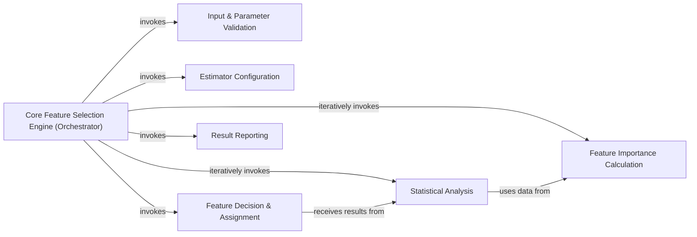

## Details

The Core Feature Selection Engine subsystem encapsulates the iterative Boruta algorithm's main loop, managing the flow of feature evaluation, comparison with shadow features, and decision-making for feature retention or rejection. Its boundaries are defined by the internal workings of the boruta.boruta_py.BorutaPy._fit method and its directly invoked helper methods within the boruta.boruta_py module.

### Core Feature Selection Engine (Orchestrator)
Manages the entire iterative Boruta feature selection process, coordinating calls to other internal components. It initializes the process, runs the main loop, and finalizes the results. This component embodies the core iterative nature of the Boruta algorithm.

**Related Classes/Methods**:

- <a href="https://github.com/scikit-learn-contrib/boruta_py/blob/master/boruta/boruta_py.py" target="_blank" rel="noopener noreferrer">`boruta.boruta_py.BorutaPy._fit`</a>

### Input & Parameter Validation
Ensures that all input parameters and data (X, y) provided to the Boruta algorithm are valid, meet required constraints, and are in the correct format (especially for pandas DataFrames) before the selection process begins.

**Related Classes/Methods**:

- <a href="https://github.com/scikit-learn-contrib/boruta_py/blob/master/boruta/boruta_py.py#L603-L613" target="_blank" rel="noopener noreferrer">`boruta.boruta_py._check_params`:603-613</a>
- <a href="https://github.com/scikit-learn-contrib/boruta_py/blob/master/boruta/boruta_py.py#L278-L284" target="_blank" rel="noopener noreferrer">`boruta.boruta_py._validate_pandas_input`:278-284</a>

### Estimator Configuration
Determines and returns the appropriate number of trees to be used by the underlying scikit-learn estimator based on the algorithm's internal logic, ensuring the estimator is correctly set up for feature importance calculation.

**Related Classes/Methods**:

- <a href="https://github.com/scikit-learn-contrib/boruta_py/blob/master/boruta/boruta_py.py#L455-L471" target="_blank" rel="noopener noreferrer">`boruta.boruta_py._get_tree_num`:455-471</a>

### Feature Importance Calculation
Generates shadow features, combines them with real features, trains the estimator (passed from the Orchestrator), and calculates feature importances for both real and shadow features in each iteration.

**Related Classes/Methods**:

- <a href="https://github.com/scikit-learn-contrib/boruta_py/blob/master/boruta/boruta_py.py#L490-L509" target="_blank" rel="noopener noreferrer">`boruta.boruta_py._add_shadows_get_imps`:490-509</a>
- <a href="https://github.com/scikit-learn-contrib/boruta_py/blob/master/boruta/boruta_py.py#L486-L488" target="_blank" rel="noopener noreferrer">`boruta.boruta_py._get_shuffle`:486-488</a>
- <a href="https://github.com/scikit-learn-contrib/boruta_py/blob/master/boruta/boruta_py.py#L473-L484" target="_blank" rel="noopener noreferrer">`boruta.boruta_py._get_imp`:473-484</a>

### Statistical Analysis
Performs statistical tests (e.g., t-tests) to compare real feature importances against shadow feature importances, handling NaN values and applying FDR correction to determine feature significance in each iteration.

**Related Classes/Methods**:

- <a href="https://github.com/scikit-learn-contrib/boruta_py/blob/master/boruta/boruta_py.py#L595-L601" target="_blank" rel="noopener noreferrer">`boruta.boruta_py._nanrankdata`:595-601</a>
- <a href="https://github.com/scikit-learn-contrib/boruta_py/blob/master/boruta/boruta_py.py#L519-L553" target="_blank" rel="noopener noreferrer">`boruta.boruta_py._do_tests`:519-553</a>
- <a href="https://github.com/scikit-learn-contrib/boruta_py/blob/master/boruta/boruta_py.py#L555-L593" target="_blank" rel="noopener noreferrer">`boruta.boruta_py._fdrcorrection`:555-593</a>

### Feature Decision & Assignment
Records "hits" for features that are deemed statistically significant in each iteration, contributing to the cumulative decision-making process for feature retention or rejection.

**Related Classes/Methods**:

- <a href="https://github.com/scikit-learn-contrib/boruta_py/blob/master/boruta/boruta_py.py#L511-L517" target="_blank" rel="noopener noreferrer">`boruta.boruta_py._assign_hits`:511-517</a>

### Result Reporting
Formats and outputs the final results of the feature selection process, including the lists of selected, rejected, and tentative features, providing a clear summary of the algorithm's outcome.

**Related Classes/Methods**:

- <a href="https://github.com/scikit-learn-contrib/boruta_py/blob/master/boruta/boruta_py.py#L615-L637" target="_blank" rel="noopener noreferrer">`boruta.boruta_py._print_results`:615-637</a>

### [FAQ](https://github.com/CodeBoarding/GeneratedOnBoardings/tree/main?tab=readme-ov-file#faq)