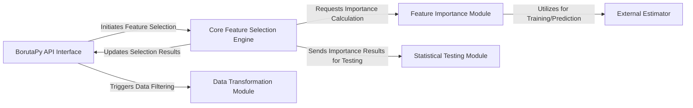

## Details

The `BorutaPy` library provides a robust feature selection mechanism by iteratively comparing the importance of original features with randomly generated "shadow" features. The process begins with the `BorutaPy API Interface` which orchestrates the entire workflow. The `Core Feature Selection Engine` drives the iterative process, leveraging the `Feature Importance Module` to calculate feature importances using an `External Estimator`. Statistical validation is performed by the `Statistical Testing Module` to confirm or reject features. Finally, the `Data Transformation Module` applies the selection results to the input data. This modular design allows for clear separation of concerns and integration with various machine learning estimators.

### BorutaPy API Interface [[Expand]](./BorutaPy_API_Interface.md)
The primary user-facing component, handling initialization and exposing `fit`, `transform`, and `fit_transform` methods. It orchestrates the overall feature selection process.

**Related Classes/Methods**:

- <a href="https://github.com/scikit-learn-contrib/boruta_py/blob/master/boruta/boruta_py.py" target="_blank" rel="noopener noreferrer">`boruta.boruta_py.BorutaPy.__init__`</a>
- <a href="https://github.com/scikit-learn-contrib/boruta_py/blob/master/boruta/boruta_py.py" target="_blank" rel="noopener noreferrer">`boruta.boruta_py.BorutaPy.fit`</a>
- <a href="https://github.com/scikit-learn-contrib/boruta_py/blob/master/boruta/boruta_py.py" target="_blank" rel="noopener noreferrer">`boruta.boruta_py.BorutaPy.transform`</a>
- <a href="https://github.com/scikit-learn-contrib/boruta_py/blob/master/boruta/boruta_py.py" target="_blank" rel="noopener noreferrer">`boruta.boruta_py.BorutaPy.fit_transform`</a>

### Core Feature Selection Engine [[Expand]](./Core_Feature_Selection_Engine.md)
Encapsulates the iterative Boruta algorithm's main loop, managing the flow of feature evaluation, comparison with shadow features, and decision-making for feature retention or rejection.

**Related Classes/Methods**:

- <a href="https://github.com/scikit-learn-contrib/boruta_py/blob/master/boruta/boruta_py.py" target="_blank" rel="noopener noreferrer">`boruta.boruta_py.BorutaPy._fit`</a>

### Feature Importance Module
Responsible for generating randomized "shadow" features and computing feature importances for both original and shadow features using the provided external estimator.

**Related Classes/Methods**:

- <a href="https://github.com/scikit-learn-contrib/boruta_py/blob/master/boruta/boruta_py.py" target="_blank" rel="noopener noreferrer">`boruta.boruta_py.BorutaPy._add_shadows_get_imps`</a>
- <a href="https://github.com/scikit-learn-contrib/boruta_py/blob/master/boruta/boruta_py.py" target="_blank" rel="noopener noreferrer">`boruta.boruta_py.BorutaPy._get_imp`</a>
- <a href="https://github.com/scikit-learn-contrib/boruta_py/blob/master/boruta/boruta_py.py" target="_blank" rel="noopener noreferrer">`boruta.boruta_py.BorutaPy._get_shuffle`</a>

### Statistical Testing Module
Performs statistical significance tests on feature importances, typically using False Discovery Rate (FDR) correction, to determine which features are truly important.

**Related Classes/Methods**:

- <a href="https://github.com/scikit-learn-contrib/boruta_py/blob/master/boruta/boruta_py.py" target="_blank" rel="noopener noreferrer">`boruta.boruta_py.BorutaPy._do_tests`</a>
- <a href="https://github.com/scikit-learn-contrib/boruta_py/blob/master/boruta/boruta_py.py" target="_blank" rel="noopener noreferrer">`boruta.boruta_py.BorutaPy._fdrcorrection`</a>

### Data Transformation Module
Applies the results of the feature selection process to input data, returning a dataset containing only the selected features (confirmed and/or tentative).

**Related Classes/Methods**:

- <a href="https://github.com/scikit-learn-contrib/boruta_py/blob/master/boruta/boruta_py.py" target="_blank" rel="noopener noreferrer">`boruta.boruta_py.BorutaPy._transform`</a>

### External Estimator
Represents the user-provided machine learning model (e.g., `RandomForestClassifier`) that `BorutaPy` wraps and uses internally to calculate feature importances. This is an external dependency to the `boruta_py` library and does not have a direct source code reference within the `boruta_py` project.

**Related Classes/Methods**: _None_

### [FAQ](https://github.com/CodeBoarding/GeneratedOnBoardings/tree/main?tab=readme-ov-file#faq)