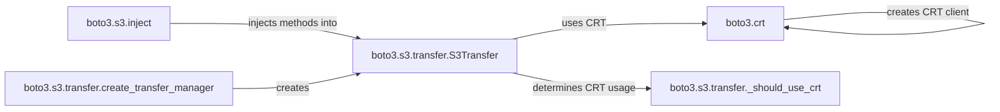

## Component Details

The Data Transfer Manager in boto3 streamlines and optimizes data transfer operations with S3. It provides high-level interfaces for uploading and downloading files and objects, automatically handling complexities such as multipart transfers for large files. The manager also integrates with the Common Runtime (CRT) client to improve transfer speeds when available. The core functionality revolves around injecting simplified methods into the S3 client, creating and configuring transfer managers, and utilizing CRT for enhanced performance.

### boto3.s3.inject
This module enhances the S3 service resource and client objects by injecting high-level methods like `upload_file`, `download_file`, `upload_fileobj`, and `download_fileobj`. These injected methods offer a user-friendly way to perform common S3 transfer operations without needing to manage the underlying complexities.
- **Related Classes/Methods**: `boto3.s3.inject`

### boto3.s3.transfer.S3Transfer
The `S3Transfer` class serves as a central point for managing S3 transfers. It encapsulates the configuration and execution logic for both uploads and downloads, including automatically using multipart transfers for large files. It determines whether to use CRT based on configuration.
- **Related Classes/Methods**: `boto3.s3.transfer.S3Transfer`

### boto3.s3.transfer.create_transfer_manager
This function is responsible for instantiating the `S3Transfer` class. It handles the configuration and initialization of the transfer manager based on provided parameters or default settings, ensuring that the transfer manager is properly set up for subsequent operations.
- **Related Classes/Methods**: `boto3.s3.transfer`

### boto3.crt
This module focuses on creating CRT-based S3 clients and transfer managers. CRT (Common Runtime) offers potentially faster transfer speeds. The module checks for CRT availability and creates CRT clients if possible, providing a performance boost for S3 operations.
- **Related Classes/Methods**: `boto3.crt`

### boto3.s3.transfer._should_use_crt
This function determines whether the CRT should be used for S3 transfers. It checks for the availability of the CRT library and any user-specified configurations that might enable or disable CRT usage, ensuring that CRT is used only when appropriate.
- **Related Classes/Methods**: `boto3.s3.transfer`
