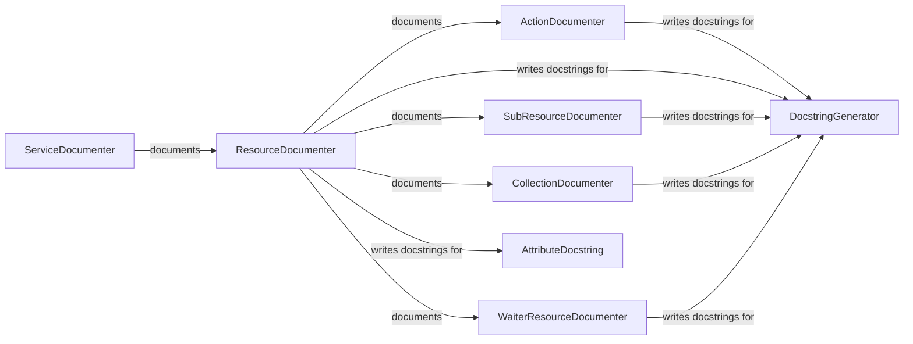

## Component Details

The Boto3 Documentation System automates the generation of API documentation for Boto3 resources and services. It orchestrates the documentation process, starting from high-level service and resource documentation down to individual actions, attributes, and collections. The system leverages docstring generation components to create comprehensive and user-friendly documentation, enhancing developer understanding and usability of the Boto3 library.

### ServiceDocumenter
The ServiceDocumenter is responsible for documenting an entire AWS service. It orchestrates the documentation of the service's client, resources, and associated examples. It acts as the entry point for documenting a service, delegating to other documenters for specific aspects.
- **Related Classes/Methods**: `boto3.boto3.docs.service.ServiceDocumenter`

### ResourceDocumenter
The ResourceDocumenter focuses on documenting a specific resource within an AWS service. It handles the introduction, examples, parameters, identifiers, attributes, references, actions, sub-resources, collections, and waiters associated with the resource. It aggregates documentation from various sub-documenters to provide a complete view of the resource.
- **Related Classes/Methods**: `boto3.boto3.docs.resource.ResourceDocumenter`

### ActionDocumenter
The ActionDocumenter is responsible for documenting actions associated with a resource. It extracts information about the action's input parameters, output, and potential errors, and formats it into a user-friendly documentation string.
- **Related Classes/Methods**: `boto3.boto3.docs.action.ActionDocumenter`, `boto3.boto3.docs.action`

### CollectionDocumenter
The CollectionDocumenter handles the documentation of resource collections, including batch actions and collection methods. It provides information on how to iterate through a collection of resources and perform actions on them.
- **Related Classes/Methods**: `boto3.boto3.docs.collection.CollectionDocumenter`, `boto3.boto3.docs.collection`

### SubResourceDocumenter
The SubResourceDocumenter documents sub-resources associated with a resource. It explains how to access and interact with resources that are nested within another resource.
- **Related Classes/Methods**: `boto3.boto3.docs.subresource.SubResourceDocumenter`, `boto3.boto3.docs.subresource`

### WaiterResourceDocumenter
The WaiterResourceDocumenter documents waiters associated with a resource. It provides information on how to wait for specific resource states, allowing developers to ensure that a resource has reached the desired state before proceeding with further operations.
- **Related Classes/Methods**: `boto3.boto3.docs.waiter.WaiterResourceDocumenter`, `boto3.boto3.docs.waiter`

### DocstringGenerator
The DocstringGenerator is an abstract component responsible for generating docstrings for various elements of Boto3 resources and services. It provides a base class for specific docstring generators, such as those for actions, attributes, and collections.
- **Related Classes/Methods**: `boto3.boto3.docs.docstring`

### AttributeDocstring
The AttributeDocstring component is responsible for writing docstrings for attributes of a resource. It extracts information about the attribute's type and description and formats it into a user-friendly docstring.
- **Related Classes/Methods**: `boto3.boto3.docs.docstring.AttributeDocstring`
