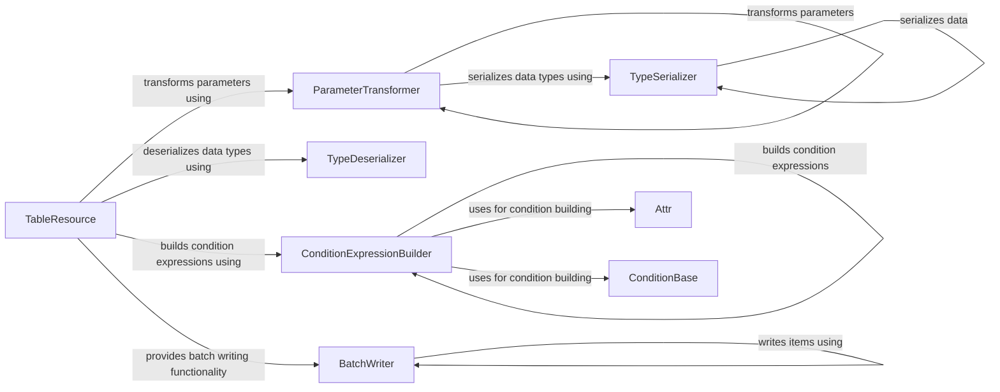

## Component Details

The DynamoDB Abstraction component streamlines interactions with DynamoDB by providing functionalities for data transformation, condition building, and batch writing. It transforms parameters and conditions, serializes and deserializes data types, and offers a convenient way to perform batch operations on DynamoDB tables, simplifying DynamoDB operations.

### TableResource
Represents a DynamoDB table and provides high-level operations for interacting with it. It encapsulates the connection to the table and offers methods for performing common actions like getting items, putting items, and scanning the table.
- **Related Classes/Methods**: `boto3.boto3.dynamodb.table.TableResource`

### ParameterTransformer
Transforms parameters before sending them to DynamoDB. It handles the conversion of complex data structures into a format that DynamoDB can understand, ensuring that the data is properly formatted for storage and retrieval.
- **Related Classes/Methods**: `boto3.boto3.dynamodb.transform.ParameterTransformer`

### TypeSerializer
Serializes Python data types into DynamoDB types. It converts Python values like strings, numbers, and lists into their corresponding DynamoDB representations, enabling seamless data storage in DynamoDB.
- **Related Classes/Methods**: `boto3.boto3.dynamodb.types.TypeSerializer`

### TypeDeserializer
Deserializes DynamoDB types into Python data types. It converts DynamoDB values back into their Python representations for use in application code, ensuring that the data is readily usable in Python applications.
- **Related Classes/Methods**: `boto3.boto3.dynamodb.types.TypeDeserializer`

### ConditionExpressionBuilder
Builds condition expressions for DynamoDB operations. It takes conditions defined using the `Attr` and `ConditionBase` classes and constructs the appropriate expression string and attribute name/value mappings, enabling complex filtering and conditional operations.
- **Related Classes/Methods**: `boto3.boto3.dynamodb.conditions.ConditionExpressionBuilder`

### Attr
Represents an attribute in a DynamoDB item and provides methods for building conditions on that attribute. It allows you to define conditions like equals, less than, greater than, etc., enabling flexible querying and filtering of data.
- **Related Classes/Methods**: `boto3.boto3.dynamodb.conditions.Attr`

### ConditionBase
Base class for conditions. It provides the basic operators for combining conditions, such as AND, OR, and NOT, allowing for the creation of complex conditional logic.
- **Related Classes/Methods**: `boto3.boto3.dynamodb.conditions.ConditionBase`

### BatchWriter
Provides a way to efficiently write multiple items to a DynamoDB table. It buffers write requests and sends them in batches to reduce the number of network calls, improving performance for bulk data operations.
- **Related Classes/Methods**: `boto3.boto3.dynamodb.table.BatchWriter`
