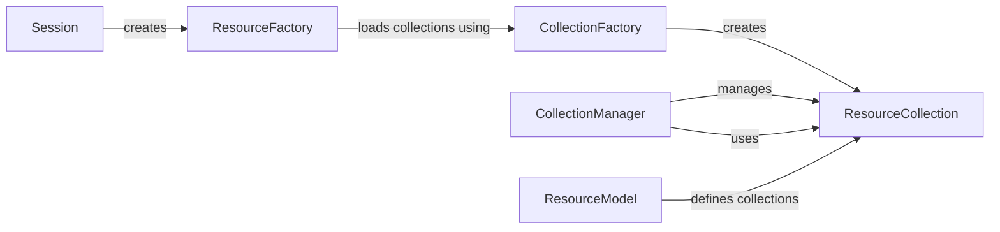

## Component Details

The Resource Collection Management component in Boto3 is responsible for providing an efficient way to iterate, filter, and manage large collections of AWS resources. It abstracts the complexities of pagination and API interactions, offering a user-friendly interface for working with resource lists. The core functionality revolves around the `ResourceCollection` class, which leverages the `CollectionManager` to handle the underlying API calls and data processing. The `CollectionFactory` dynamically creates these collections based on service definitions, ensuring consistency and flexibility across different AWS services. The `Session` object initializes and configures the environment, while the `ResourceFactory` creates resource classes and loads collections. The `ResourceModel` defines the structure of the resources within the collection.

### Session
The Session object serves as the entry point for interacting with AWS services. It manages the configuration, authentication, and creation of both service clients and resources. It provides a central point for setting credentials, region, and other settings that affect how Boto3 interacts with AWS.
- **Related Classes/Methods**: `boto3.session.Session`

### ResourceFactory
The ResourceFactory dynamically creates Resource classes based on service definitions. It handles the loading of collections associated with each resource, ensuring that the resource objects have the appropriate methods for accessing related resources.
- **Related Classes/Methods**: `boto3.resources.factory.ResourceFactory`

### CollectionFactory
The CollectionFactory is responsible for creating collection classes and methods from collection definitions. It handles batch actions and documented collection methods, providing a consistent way to define and create resource collections.
- **Related Classes/Methods**: `boto3.resources.collection.CollectionFactory`

### ResourceCollection
The ResourceCollection class represents a collection of resources and provides methods for iterating, filtering, limiting, and paginating the collection. It acts as a wrapper around the underlying API calls, simplifying the process of working with large resource lists.
- **Related Classes/Methods**: `boto3.resources.collection.ResourceCollection`

### CollectionManager
The CollectionManager manages the creation and retrieval of resource collections. It provides methods for iterating, filtering, limiting, and paginating the collection, delegating to the ResourceCollection. It acts as an intermediary between the resource and the collection.
- **Related Classes/Methods**: `boto3.resources.collection.CollectionManager`

### ResourceModel
Represents the model of a resource, including its attributes and collections. It defines the structure and properties of a resource, providing a blueprint for creating resource objects.
- **Related Classes/Methods**: `boto3.resources.model.ResourceModel`
