```mermaid
graph LR
    Client_Creator_boto3_boto3_client_["Client Creator (boto3.boto3:client)"]
    Resource_Factory_boto3_boto3_resources_factory_ResourceFactory_["Resource Factory (boto3.boto3.resources.factory.ResourceFactory)"]
    Resource_Model_boto3_boto3_resources_model_ResourceModel_["Resource Model (boto3.boto3.resources.model.ResourceModel)"]
    Resource_Creator_boto3_boto3_resource_["Resource Creator (boto3.boto3:resource)"]
    Session_Resource_Creator_boto3_boto3_session_Session_resource_["Session Resource Creator (boto3.boto3.session.Session:resource)"]
    Client_Creator_boto3_boto3_client_ -- "creates" --> Resource_Creator_boto3_boto3_resource_
    Session_Resource_Creator_boto3_boto3_session_Session_resource_ -- "creates" --> Resource_Factory_boto3_boto3_resources_factory_ResourceFactory_
    Resource_Factory_boto3_boto3_resources_factory_ResourceFactory_ -- "uses" --> Resource_Model_boto3_boto3_resources_model_ResourceModel_
    Resource_Factory_boto3_boto3_resources_factory_ResourceFactory_ -- "loads definitions from" --> Resource_Model_boto3_boto3_resources_model_ResourceModel_
    Resource_Creator_boto3_boto3_resource_ -- "creates" --> Resource_Factory_boto3_boto3_resources_factory_ResourceFactory_
```

## Component Details

The Boto3 Service Interface provides a way to interact with AWS services, abstracting away the complexities of direct API calls. It encompasses both low-level clients and high-level resources. Low-level clients offer direct access to AWS APIs, while high-level resources provide an object-oriented interface. The ResourceFactory dynamically creates resource classes based on service definitions, and ResourceModel encapsulates the metadata of a resource. The Session object allows for customization during resource creation.

### Client Creator (boto3.boto3:client)
The Client Creator is responsible for generating low-level service clients. These clients directly expose AWS APIs and provide a way to interact with AWS services at the API level. It handles authentication, request signing, and response parsing.
- **Related Classes/Methods**: `boto3.boto3:client`

### Resource Factory (boto3.boto3.resources.factory.ResourceFactory)
The Resource Factory dynamically creates resource classes based on a service's resource definition. It loads definitions, identifiers, actions, attributes, collections, and waiters to construct the resource classes. It uses ResourceModel to understand the structure of the resource.
- **Related Classes/Methods**: `boto3.boto3.resources.factory.ResourceFactory`

### Resource Model (boto3.boto3.resources.model.ResourceModel)
The Resource Model encapsulates the metadata and structure of a resource, including identifiers, attributes, actions, collections, and waiters. It is used by ResourceFactory to understand the resource's structure and create resource classes.
- **Related Classes/Methods**: `boto3.boto3.resources.model.ResourceModel`

### Resource Creator (boto3.boto3:resource)
The Resource Creator is responsible for creating high-level service resources, providing an object-oriented interface to AWS services. It simplifies interactions with AWS by providing a more intuitive and Pythonic way to manage AWS resources.
- **Related Classes/Methods**: `boto3.boto3:resource`

### Session Resource Creator (boto3.boto3.session.Session:resource)
The Session Resource Creator creates resources using the session object, allowing customization of the resource creation process through session-specific configurations. It enables users to configure aspects like credentials, region, and endpoint resolution.
- **Related Classes/Methods**: `boto3.boto3.session.Session:resource`
