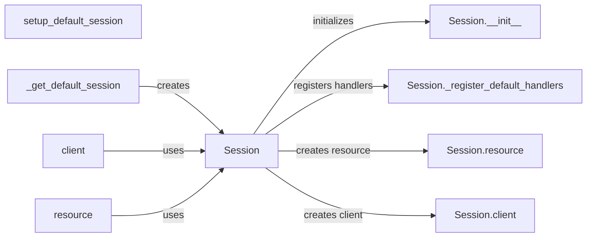

## Component Details

The Session Manager in boto3 is responsible for managing and configuring AWS sessions. It provides a centralized way to create clients and resources, handling authentication, region selection, and other global settings. The session manager ensures a consistent and configurable environment for interacting with AWS services, whether through low-level clients or high-level resources.

### Session
The Session object is the central point for managing state and configuration when interacting with AWS services. It handles authentication, region selection, and other global settings. It acts as a factory for creating both clients and resources.
- **Related Classes/Methods**: `boto3.session.Session`

### setup_default_session
This function sets up the default boto3 session, which is used when a session is not explicitly provided. It ensures that a default session is available for convenience, allowing users to interact with AWS services without explicitly creating a session.
- **Related Classes/Methods**: `boto3.boto3.setup_default_session`

### _get_default_session
This function retrieves the default boto3 session. If one doesn't exist, it creates one. It ensures that a default session is available for use, providing a fallback mechanism when no explicit session is provided.
- **Related Classes/Methods**: `boto3.boto3._get_default_session`

### client
This function creates a low-level client for a specific AWS service. Clients provide direct access to the service's API operations, allowing for fine-grained control over interactions with AWS services.
- **Related Classes/Methods**: `boto3.boto3.client`

### resource
This function creates a high-level resource object for a specific AWS service. Resources provide an object-oriented interface to the service, simplifying common tasks and providing a more intuitive way to interact with AWS services.
- **Related Classes/Methods**: `boto3.boto3.resource`

### Session.__init__
The constructor for the Session class. It initializes the session with configuration and credentials, setting up the environment for subsequent interactions with AWS services.
- **Related Classes/Methods**: `boto3.session.Session`

### Session._register_default_handlers
Registers default event handlers for the session. These handlers can modify the behavior of the session, allowing for customization and extension of boto3's functionality.
- **Related Classes/Methods**: `boto3.session.Session`

### Session.resource
Creates a resource object using the session's configuration. This allows for easy creation of resource objects associated with the session, ensuring that the resource inherits the session's configuration and credentials.
- **Related Classes/Methods**: `boto3.session.Session`

### Session.client
Creates a client object using the session's configuration. This allows for easy creation of client objects associated with the session, ensuring that the client inherits the session's configuration and credentials.
- **Related Classes/Methods**: `boto3.session.Session`
