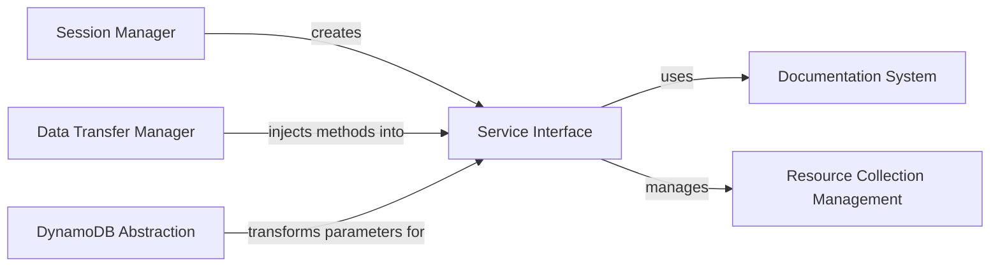

## Component Details

Boto3 is a Python SDK that allows developers to interact with Amazon Web Services (AWS). The core functionality revolves around managing sessions, creating clients and resources, handling data transfer, and generating documentation. The session manager initializes the environment, while client and resource factories provide interfaces to AWS services. Optimized data transfer mechanisms and documentation tools enhance the developer experience.

### Session Manager
The Session Manager is responsible for managing AWS credentials, regions, and configurations. It provides a central point for creating clients and resources, and handles the configuration and authentication aspects of interacting with AWS. It initializes and configures the environment for subsequent operations.
- **Related Classes/Methods**: `boto3.boto3.session.Session`, `boto3.boto3:setup_default_session`, `boto3.boto3:_get_default_session`

### Service Interface
The Service Interface encompasses both the Service Client Creator and the Resource Factory. The Service Client Creator is responsible for creating low-level service clients that directly interact with AWS APIs. The Resource Factory is responsible for creating high-level resource objects that provide an object-oriented interface to AWS services. These components abstract the complexity of interacting with AWS services.
- **Related Classes/Methods**: `boto3.boto3:client`, `boto3.boto3:resource`, `boto3.boto3.resources.factory.ResourceFactory`, `boto3.boto3.resources.model.ResourceModel`

### Data Transfer Manager
The Data Transfer Manager handles optimized data transfer operations, primarily focusing on S3. It includes the S3 Transfer Manager, which manages uploads and downloads to and from S3, including large files and multipart transfers. It also integrates the CRT Client, offering improved performance and efficiency for S3 operations.
- **Related Classes/Methods**: `boto3.boto3.s3.transfer.S3Transfer`, `boto3.boto3.s3.transfer:create_transfer_manager`, `boto3.boto3.s3.inject:upload_file`, `boto3.boto3.s3.inject:download_file`, `boto3.boto3.s3.inject:upload_fileobj`, `boto3.boto3.s3.inject:download_fileobj`, `boto3.boto3.crt:get_crt_s3_client`, `boto3.boto3.crt:_create_crt_s3_client`, `boto3.boto3.crt:create_crt_transfer_manager`

### DynamoDB Abstraction
The DynamoDB Abstraction component streamlines interactions with DynamoDB by handling data transformation and batch writing functionalities. It transforms parameters and conditions, serializes and deserializes data types, and provides a convenient way to perform batch operations on DynamoDB tables, simplifying DynamoDB operations.
- **Related Classes/Methods**: `boto3.boto3.dynamodb.transform.TransformationInjector`, `boto3.boto3.dynamodb.transform.ParameterTransformer`, `boto3.boto3.dynamodb.types.TypeSerializer`, `boto3.boto3.dynamodb.types.TypeDeserializer`, `boto3.boto3.dynamodb.conditions.ConditionExpressionBuilder`, `boto3.boto3.dynamodb.table.BatchWriter`

### Documentation System
The Documentation System automates the generation of documentation for Boto3 resources and services, including actions, attributes, and collections. It simplifies the process of creating API documentation, making it easier for developers to understand and use Boto3.
- **Related Classes/Methods**: `boto3.boto3.docs.resource.ResourceDocumenter`, `boto3.boto3.docs.service.ServiceDocumenter`, `boto3.boto3.docs:generate_docs`

### Resource Collection Management
The Resource Collection Management component handles the pagination, filtering, and limiting of resource collections. It provides mechanisms for efficiently iterating over large collections of resources, improving performance and usability.
- **Related Classes/Methods**: `boto3.boto3.resources.collection.CollectionManager`, `boto3.boto3.resources.collection.ResourceCollection`