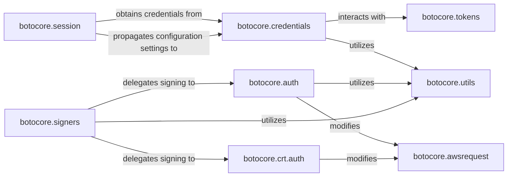

## Details

The `Authentication & Signing` subsystem in `botocore` is a critical part of the SDK, ensuring secure communication with AWS services. It encapsulates the logic for obtaining and managing AWS credentials and tokens, as well as cryptographically signing outgoing requests.

### botocore.session
Manages the overall lifecycle of a Botocore session, including the registration and retrieval of credential and token providers, and propagating configuration settings across the client. It acts as the central orchestrator for setting up authentication and signing contexts.

**Related Classes/Methods**:

- <a href="https://github.com/boto/botocore/blob/develop/botocore/session.py" target="_blank" rel="noopener noreferrer">`botocore.session`</a>

### botocore.credentials
Manages the lifecycle of AWS access credentials, including loading from various sources (e.g., environment variables, shared credential files, IAM roles), caching, and refreshing expired credentials.

**Related Classes/Methods**:

- <a href="https://github.com/boto/botocore/blob/develop/botocore/credentials.py" target="_blank" rel="noopener noreferrer">`botocore.credentials`</a>

### botocore.tokens
Specifically handles the acquisition, caching, and refreshing of authentication tokens, with a particular focus on AWS SSO (Single Sign-On) tokens. It provides a specialized credential source.

**Related Classes/Methods**:

- <a href="https://github.com/boto/botocore/blob/develop/botocore/tokens.py" target="_blank" rel="noopener noreferrer">`botocore.tokens`</a>

### botocore.awsrequest
Represents an HTTP request destined for an AWS service. This object serves as the mutable data structure that is built by the client and subsequently modified (signed) by the authentication components.

**Related Classes/Methods**:

- <a href="https://github.com/boto/botocore/blob/develop/botocore/awsrequest.py" target="_blank" rel="noopener noreferrer">`botocore.awsrequest`</a>

### botocore.signers
Acts as the primary interface for all request signing operations. It determines the appropriate signing algorithm (e.g., Signature Version 4) and delegates the actual cryptographic signing to specific implementations. It also handles presigning URLs.

**Related Classes/Methods**:

- <a href="https://github.com/boto/botocore/blob/develop/botocore/signers.py" target="_blank" rel="noopener noreferrer">`botocore.signers`</a>

### botocore.auth
Implements the core cryptographic logic for AWS Signature Version 4, which is the standard process for authenticating requests to AWS services.

**Related Classes/Methods**:

- <a href="https://github.com/boto/botocore/blob/develop/botocore/auth.py" target="_blank" rel="noopener noreferrer">`botocore.auth`</a>

### botocore.crt.auth
Provides an alternative implementation for AWS request signing, leveraging the AWS Common Runtime (CRT) for potentially optimized performance or specific use cases.

**Related Classes/Methods**:

- <a href="https://github.com/boto/botocore/blob/develop/botocore/crt/auth.py" target="_blank" rel="noopener noreferrer">`botocore.crt.auth`</a>

### botocore.utils
Provides a collection of common utility functions critical for both credential management and request signing, such as timestamp parsing, ARN (Amazon Resource Name) handling, and credential caching mechanisms.

**Related Classes/Methods**:

- <a href="https://github.com/boto/botocore/blob/develop/botocore/utils.py" target="_blank" rel="noopener noreferrer">`botocore.utils`</a>

### [FAQ](https://github.com/CodeBoarding/GeneratedOnBoardings/tree/main?tab=readme-ov-file#faq)