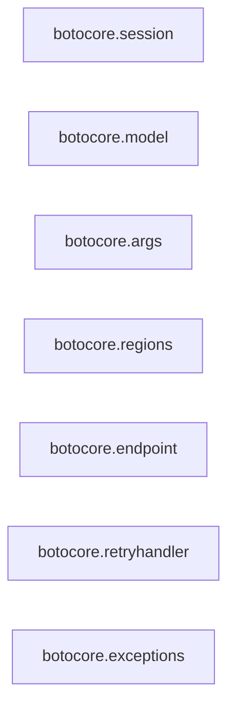

## Details

One paragraph explaining the functionality which is represented by this graph. What the main flow is and what is its purpose.

### botocore.session
Manages AWS sessions and credentials.

**Related Classes/Methods**:

- <a href="https://github.com/boto/botocore/blob/develop/botocore/session.py" target="_blank" rel="noopener noreferrer">`botocore.session.Session`</a>

### botocore.model
Handles AWS service models.

**Related Classes/Methods**:

- <a href="https://github.com/boto/botocore/blob/develop/botocore/model.py" target="_blank" rel="noopener noreferrer">`botocore.model.Model`</a>

### botocore.args
Manages AWS request arguments.

**Related Classes/Methods**:

- <a href="https://github.com/boto/botocore/blob/develop/botocore/args.py" target="_blank" rel="noopener noreferrer">`botocore.args.Args`</a>

### botocore.regions
Manages AWS regions.

**Related Classes/Methods**:

- <a href="https://github.com/boto/botocore/blob/develop/botocore/regions.py" target="_blank" rel="noopener noreferrer">`botocore.regions.Regions`</a>

### botocore.endpoint
Handles AWS endpoint configurations.

**Related Classes/Methods**:

- <a href="https://github.com/boto/botocore/blob/develop/botocore/endpoint.py#L77-L383" target="_blank" rel="noopener noreferrer">`botocore.endpoint.Endpoint`:77-383</a>

### botocore.retryhandler
Manages AWS retry handling.

**Related Classes/Methods**:

- <a href="https://github.com/boto/botocore/blob/develop/botocore/retryhandler.py#L173-L211" target="_blank" rel="noopener noreferrer">`botocore.retryhandler.RetryHandler`:173-211</a>

### botocore.exceptions
Handles botocore exceptions.

**Related Classes/Methods**:

- <a href="https://github.com/boto/botocore/blob/develop/botocore/exceptions.py#L517-L551" target="_blank" rel="noopener noreferrer">`botocore.exceptions.ClientError`:517-551</a>

### [FAQ](https://github.com/CodeBoarding/GeneratedOnBoardings/tree/main?tab=readme-ov-file#faq)