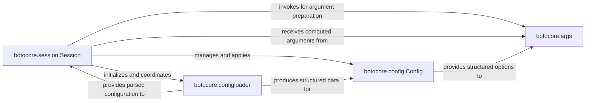

## Details

The `botocore` subsystem centers around the `botocore.session.Session` component, which acts as the central orchestrator. The `Session` initializes and coordinates with `botocore.configloader` to load and parse configuration data. This parsed configuration is then provided to the `Session` and further processed by `botocore.config.Config`, which represents the structured configuration options. The `configloader` also directly produces structured data for the `Config` component. When preparing for API calls, the `Session` invokes `botocore.args` for argument computation, leveraging the structured options provided by `botocore.config.Config`. Finally, `botocore.args` returns the computed arguments back to the `Session` for subsequent processing. This flow ensures a clear separation of concerns, with the `Session` managing the overall lifecycle and coordination, `configloader` handling raw configuration, `Config` providing structured settings, and `args` preparing call-specific parameters.

### botocore.session.Session
The primary orchestrator and entry point for the Botocore library. It initializes the environment, manages the lifecycle of other core components, handles global configuration, and facilitates the creation of service clients. It serves as the central hub providing context for all operations.

**Related Classes/Methods**:

- <a href="https://github.com/boto/botocore/blob/develop/botocore/session.py" target="_blank" rel="noopener noreferrer">`botocore.session.Session`</a>

### botocore.configloader
Dedicated to the I/O and parsing of configuration data. It reads configuration from various sources (e.g., files, environment variables, profiles) and transforms this raw data into a structured format suitable for consumption by the session and configuration objects.

**Related Classes/Methods**:

- <a href="https://github.com/boto/botocore/blob/develop/botocore/configloader.py" target="_blank" rel="noopener noreferrer">`botocore.configloader`</a>

### botocore.config.Config
Represents a structured, validated, and mergeable collection of configuration options. It provides the data model for various settings such as S3 transfer configurations, retry behavior, and client-specific options, ensuring consistency and type safety for configuration values.

**Related Classes/Methods**:

- <a href="https://github.com/boto/botocore/blob/develop/botocore/config.py#L25-L475" target="_blank" rel="noopener noreferrer">`botocore.config.Config`:25-475</a>

### botocore.args
Computes the final, concrete arguments required for making API calls. This involves resolving endpoints, applying checksums, handling retry logic, and other pre-request processing, based on the established session context and configuration. It acts as the "argument builder" or "request preparer."

**Related Classes/Methods**:

- <a href="https://github.com/boto/botocore/blob/develop/botocore/args.py" target="_blank" rel="noopener noreferrer">`botocore.args`</a>

### [FAQ](https://github.com/CodeBoarding/GeneratedOnBoardings/tree/main?tab=readme-ov-file#faq)