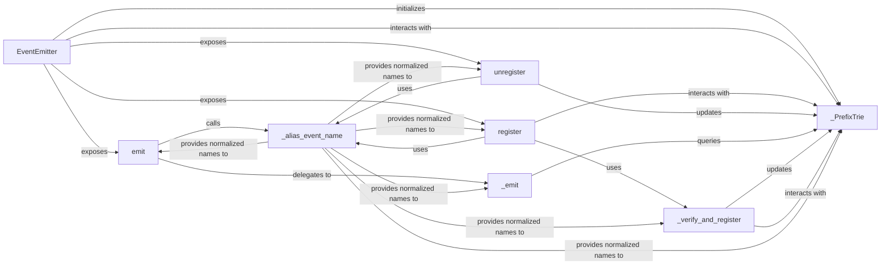

## Details

The `botocore.hooks` subsystem provides a robust and extensible event and plugin management system. At its core, the `EventEmitter` component serves as the central hub, exposing public interfaces for event `emit`ting, handler `register`ing, and `unregister`ing. It leverages an internal `_PrefixTrie` data structure for efficient storage and retrieval of event handlers, optimizing performance for a large number of events. Supporting this core functionality are internal components like `_emit` for dispatching events, `_verify_and_register` for ensuring handler integrity, and `_alias_event_name` for consistent event name handling. This architecture ensures a clear separation of concerns, allowing for flexible and scalable event-driven interactions within the `botocore` project.

### EventEmitter
The central dispatcher and manager for the entire event and plugin system. It orchestrates the lifecycle of events and their associated handlers, acting as the primary interface for event management.

**Related Classes/Methods**:

- <a href="https://github.com/boto/botocore/blob/develop/botocore/hooks.py" target="_blank" rel="noopener noreferrer">`EventEmitter`</a>

### emit
The public method responsible for triggering a specific event. When called, it initiates the dispatch process, notifying all registered handlers for that event.

**Related Classes/Methods**:

- <a href="https://github.com/boto/botocore/blob/develop/botocore/hooks.py" target="_blank" rel="noopener noreferrer">`EventEmitter.emit`</a>

### register
The public method used to add a handler function to be invoked when a specific event occurs. This is the primary mechanism for components and plugins to subscribe to events.

**Related Classes/Methods**:

- <a href="https://github.com/boto/botocore/blob/develop/botocore/hooks.py" target="_blank" rel="noopener noreferrer">`EventEmitter.register`</a>

### unregister
The public method for removing a previously registered handler from an event. It allows components to unsubscribe from events they no longer need to handle.

**Related Classes/Methods**:

- <a href="https://github.com/boto/botocore/blob/develop/botocore/hooks.py#L442-L452" target="_blank" rel="noopener noreferrer">`EventEmitter.unregister`:442-452</a>

### _PrefixTrie
An internal, optimized data structure (likely a trie or prefix tree) used for storing and efficiently retrieving event handlers. It enables fast lookups based on event name prefixes, crucial for performance in a system with many events and handlers.

**Related Classes/Methods**:

- <a href="https://github.com/boto/botocore/blob/develop/botocore/hooks.py#L506-L660" target="_blank" rel="noopener noreferrer">`_PrefixTrie`:506-660</a>

### _emit
Contains the internal logic for iterating through and executing the handlers associated with a given event. This component handles the actual dispatch process after an event is triggered.

**Related Classes/Methods**:

- <a href="https://github.com/boto/botocore/blob/develop/botocore/hooks.py" target="_blank" rel="noopener noreferrer">`EventEmitter._emit`</a>

### _verify_and_register
An internal utility responsible for validating handler functions (e.g., checking if they are callable or have the correct signature) before they are added to the system. This ensures the integrity and robustness of registered handlers.

**Related Classes/Methods**:

- <a href="https://github.com/boto/botocore/blob/develop/botocore/hooks.py#L143-L153" target="_blank" rel="noopener noreferrer">`_verify_and_register`:143-153</a>

### _alias_event_name
An internal utility that normalizes or aliases event names. This ensures consistency across the system, handling potential variations in how event names are provided or stored.

**Related Classes/Methods**:

- <a href="https://github.com/boto/botocore/blob/develop/botocore/hooks.py#L454-L489" target="_blank" rel="noopener noreferrer">`_alias_event_name`:454-489</a>

### [FAQ](https://github.com/CodeBoarding/GeneratedOnBoardings/tree/main?tab=readme-ov-file#faq)