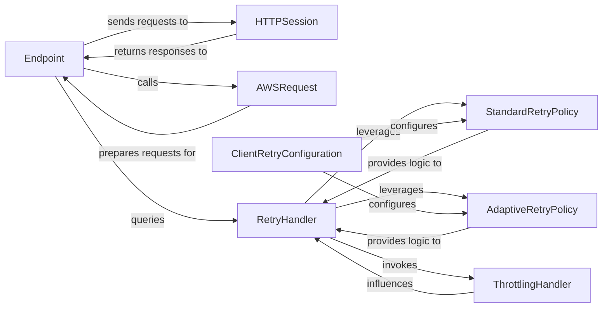

## Details

The feedback highlights a crucial point regarding the clarity and conciseness of component relationships, specifically for the `Endpoint` and `HTTPSession` pair. The original analysis listed three relationships, which exceeds the recommended maximum of two per component pair for optimal documentation and diagram generation. This redundancy can lead to cluttered diagrams and less precise architectural descriptions. By consolidating the relationships between `Endpoint` and `HTTPSession` from three to two, we achieve better adherence to the "Verify max 2 relationships per component pair" criterion. The revised relationships, `(Endpoint, sends requests to, HTTPSession)` and `(HTTPSession, returns responses to, Endpoint)`, accurately capture the bidirectional communication flow without redundancy, making them highly suitable for both written documentation and visual representation as arrows in a flow graph. All other relationships were deemed clear and consistent, so they remain unchanged.

### Endpoint
Manages the lifecycle of sending a single HTTP request, encompassing request preparation, actual transmission, and the application of retry logic. It acts as the primary entry point for sending requests within the SDK.

**Related Classes/Methods**:

- <a href="https://github.com/boto/botocore/blob/develop/botocore/endpoint.py" target="_blank" rel="noopener noreferrer">`botocore.endpoint`</a>

### HTTPSession
Manages the actual transmission of HTTP requests and reception of responses over the network. It handles low-level concerns like connection pooling, proxies, and SSL/TLS.

**Related Classes/Methods**:

- <a href="https://github.com/boto/botocore/blob/develop/botocore/httpsession.py" target="_blank" rel="noopener noreferrer">`botocore.httpsession`</a>

### AWSRequest
Transforms a high-level request dictionary into a structured AWS HTTP request object, including setting headers, preparing the body, and applying checksums (e.g., via `HTTPChecksum`).

**Related Classes/Methods**:

- <a href="https://github.com/boto/botocore/blob/develop/botocore/awsrequest.py" target="_blank" rel="noopener noreferrer">`botocore.awsrequest`</a>

### RetryHandler
Evaluates whether a failed request should be retried based on configured policies and manages the overall retry state for a given request. It orchestrates the application of various retry strategies.

**Related Classes/Methods**:

- <a href="https://github.com/boto/botocore/blob/develop/botocore/retryhandler.py" target="_blank" rel="noopener noreferrer">`botocore.retryhandler`</a>

### StandardRetryPolicy
Implements the default, fixed-backoff retry conditions and logic for common transient errors, providing a baseline retry strategy.

**Related Classes/Methods**:

- <a href="https://github.com/boto/botocore/blob/develop/botocore/retries/standard.py" target="_blank" rel="noopener noreferrer">`botocore.retries.standard`</a>

### AdaptiveRetryPolicy
Implements dynamic retry logic, including client-side rate limiting based on server feedback (e.g., `x-amz-retry-after` headers), adapting to network conditions and service load.

**Related Classes/Methods**:

- <a href="https://github.com/boto/botocore/blob/develop/botocore/retries/adaptive.py" target="_blank" rel="noopener noreferrer">`botocore.retries.adaptive`</a>

### ThrottlingHandler
Specifically handles and reacts to throttling errors, adjusting internal state or providing feedback to the `RetryHandler` for future retry decisions, ensuring graceful degradation under high load.

**Related Classes/Methods**:

- <a href="https://github.com/boto/botocore/blob/develop/botocore/retries/throttling.py" target="_blank" rel="noopener noreferrer">`botocore.retries.throttling`</a>

### ClientRetryConfiguration
Configures and registers the appropriate retry strategies (legacy, standard, adaptive) when a new client is instantiated, ensuring the client is ready to handle retries according to specified policies.

**Related Classes/Methods**:

- <a href="https://github.com/boto/botocore/blob/develop/botocore/client.py" target="_blank" rel="noopener noreferrer">`botocore.client`</a>

### [FAQ](https://github.com/CodeBoarding/GeneratedOnBoardings/tree/main?tab=readme-ov-file#faq)