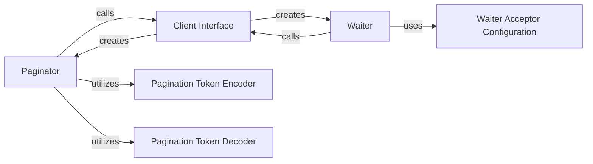

## Details

The Paginator & Waiter Utilities subsystem provides essential abstractions for interacting with paginated AWS API responses and managing resource state polling. It adheres to Library/SDK patterns by offering clear client interfaces, core utility classes, and supporting configuration components.

### Paginator
The core component for iterating over paginated AWS API responses. It encapsulates the logic for managing pagination tokens, making subsequent API calls, and aggregating results.

**Related Classes/Methods**:

- <a href="https://github.com/boto/botocore/blob/develop/botocore/paginate.py#L599-L702" target="_blank" rel="noopener noreferrer">`botocore.paginate.Paginator`:599-702</a>

### Waiter
The core component for polling AWS API resources until a desired state is met. It defines conditions and logic for polling, including retry mechanisms and state transitions.

**Related Classes/Methods**:

- <a href="https://github.com/boto/botocore/blob/develop/botocore/waiter.py#L315-L396" target="_blank" rel="noopener noreferrer">`botocore.waiter.Waiter`:315-396</a>

### Client Interface
Acts as the primary Client/Service Interface and Adapter for the subsystem. It provides factory methods (get_paginator, get_waiter) for users to obtain configured Paginator and Waiter instances.

**Related Classes/Methods**:

- <a href="https://github.com/boto/botocore/blob/develop/botocore/client.py#L907-L1355" target="_blank" rel="noopener noreferrer">`botocore.client.BaseClient`:907-1355</a>

### Pagination Token Encoder
A utility component responsible for serializing pagination tokens, which is crucial for maintaining state across multiple API calls during pagination.

**Related Classes/Methods**:

- <a href="https://github.com/boto/botocore/blob/develop/botocore/paginate.py#L30-L105" target="_blank" rel="noopener noreferrer">`botocore.paginate.TokenEncoder`:30-105</a>

### Pagination Token Decoder
A utility component responsible for deserializing pagination tokens, allowing the Paginator to correctly interpret and resume pagination from a given state.

**Related Classes/Methods**:

- <a href="https://github.com/boto/botocore/blob/develop/botocore/paginate.py#L108-L173" target="_blank" rel="noopener noreferrer">`botocore.paginate.TokenDecoder`:108-173</a>

### Waiter Acceptor Configuration
A configuration component that defines the conditions (e.g., success, failure, retry) for a waiter to transition between states, dictating its behavior.

**Related Classes/Methods**:

- <a href="https://github.com/boto/botocore/blob/develop/botocore/waiter.py#L172-L312" target="_blank" rel="noopener noreferrer">`botocore.waiter.AcceptorConfig`:172-312</a>

### [FAQ](https://github.com/CodeBoarding/GeneratedOnBoardings/tree/main?tab=readme-ov-file#faq)