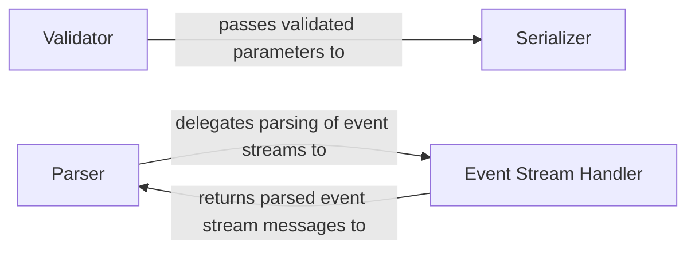

## Details

The core of this subsystem in botocore revolves around processing requests and responses for AWS services. It starts with the Validator ensuring that user-provided input parameters conform to the AWS service model's constraints. Once validated, the Serializer transforms these parameters into the specific wire format required by the AWS API, preparing the request for transmission. Upon receiving a response from the AWS service, the Parser takes over, converting the raw HTTP response into structured Python objects. For specialized handling of event-driven communication, the Parser delegates to the Event Stream Handler, which is responsible for the intricate parsing and validation of messages within AWS event streams, including low-level framing and checksum verification. This modular design ensures robust and efficient interaction with diverse AWS service protocols.

### Validator
Validates user-provided Python input parameters against constraints defined in the AWS service model. This includes checking for required parameters, correct data types, valid ranges, and other structural requirements before the request is serialized and sent.

**Related Classes/Methods**:

- <a href="https://github.com/boto/botocore/blob/develop/botocore/validate.py#L181-L366" target="_blank" rel="noopener noreferrer">`botocore.validate.ParamValidator`:181-366</a>

### Serializer
Responsible for transforming high-level Python input parameters into the specific wire format (e.g., JSON, XML, query string, headers) required by AWS service APIs. This includes rendering URI templates and encoding payloads according to the service model.

**Related Classes/Methods**:

- <a href="https://github.com/boto/botocore/blob/develop/botocore/serialize.py#L79-L226" target="_blank" rel="noopener noreferrer">`botocore.serialize.Serializer`:79-226</a>

### Parser
Converts raw HTTP responses received from AWS services into structured Python objects. It handles various response formats and also manages the parsing of modeled and generic error responses.

**Related Classes/Methods**:

- <a href="https://github.com/boto/botocore/blob/develop/botocore/parsers.py#L197-L412" target="_blank" rel="noopener noreferrer">`botocore.parsers.ResponseParser`:197-412</a>

### Event Stream Handler
Provides specialized functionality for parsing and validating messages within AWS event streams. This component handles low-level framing details, headers, payloads, and checksum validation specific to event stream protocols.

**Related Classes/Methods**:

- <a href="https://github.com/boto/botocore/blob/develop/botocore/eventstream.py" target="_blank" rel="noopener noreferrer">`botocore.eventstream.EventStreamParser`</a>

### [FAQ](https://github.com/CodeBoarding/GeneratedOnBoardings/tree/main?tab=readme-ov-file#faq)