```mermaid
graph LR
    botocore_loaders["botocore.loaders"]
    botocore_model_ServiceModel["botocore.model.ServiceModel"]
    botocore_regions_EndpointResolver["botocore.regions.EndpointResolver"]
    botocore_endpoint_provider_EndpointProvider["botocore.endpoint_provider.EndpointProvider"]
    botocore_discovery_EndpointDiscoveryManager["botocore.discovery.EndpointDiscoveryManager"]
    botocore_loaders -- "provides data to" --> botocore_model_ServiceModel
    botocore_loaders -- "supplies metadata to" --> botocore_regions_EndpointResolver
    botocore_loaders -- "provides rulesets to" --> botocore_endpoint_provider_EndpointProvider
    botocore_model_ServiceModel -- "informs" --> botocore_regions_EndpointResolver
    botocore_model_ServiceModel -- "supplies metadata to" --> botocore_endpoint_provider_EndpointProvider
    botocore_regions_EndpointResolver -- "delegates to" --> botocore_endpoint_provider_EndpointProvider
    botocore_endpoint_provider_EndpointProvider -- "queries" --> botocore_discovery_EndpointDiscoveryManager
    botocore_discovery_EndpointDiscoveryManager -- "provides endpoints to" --> botocore_endpoint_provider_EndpointProvider
```

## Details

The `Service Model & Endpoint Resolution` subsystem in `botocore` is responsible for programmatically representing AWS service APIs and determining the correct endpoint URLs and associated metadata for service interactions. This involves understanding service definitions, resolving static and dynamic endpoints, and managing endpoint discovery.

### botocore.loaders
Acts as the "Data Loader/Resource Manager" for the subsystem. It is responsible for loading external data, such as service models, region data, and endpoint rules, into the system from definition files (e.g., JSON files).

**Related Classes/Methods**:

- <a href="https://github.com/boto/botocore/blob/develop/botocore/loaders.py" target="_blank" rel="noopener noreferrer">`botocore.loaders`</a>

### botocore.model.ServiceModel
Defines the programmatic representation of AWS service APIs. It serves as the "API Definition Layer" or "Metadata Store," providing a structured view of each service's operations, input/output shapes, and error definitions.

**Related Classes/Methods**:

- <a href="https://github.com/boto/botocore/blob/develop/botocore/model.py#L301-L514" target="_blank" rel="noopener noreferrer">`botocore.model.ServiceModel`:301-514</a>

### botocore.regions.EndpointResolver
Manages AWS partition and region metadata. It functions as the "Static Endpoint Configuration & Resolution" component, primarily constructing endpoint URLs based on service, region, and static configuration for well-known region-specific endpoints.

**Related Classes/Methods**:

- <a href="https://github.com/boto/botocore/blob/develop/botocore/regions.py#L116-L425" target="_blank" rel="noopener noreferrer">`botocore.regions.EndpointResolver`:116-425</a>

### botocore.endpoint_provider.EndpointProvider
Implements the "Dynamic Endpoint Rule Engine." It evaluates endpoint rulesets to derive the final endpoint URL, signing region, and other properties for a given request, providing a more dynamic and expressive way to define endpoints.

**Related Classes/Methods**:

- <a href="https://github.com/boto/botocore/blob/develop/botocore/endpoint_provider.py#L701-L723" target="_blank" rel="noopener noreferrer">`botocore.endpoint_provider.EndpointProvider`:701-723</a>

### botocore.discovery.EndpointDiscoveryManager
Handles the "Dynamic Endpoint Discovery & Caching" for services that require runtime endpoint resolution (e.g., certain data plane operations). It manages the lifecycle of discovered endpoints.

**Related Classes/Methods**:

- <a href="https://github.com/boto/botocore/blob/develop/botocore/discovery.py#L99-L222" target="_blank" rel="noopener noreferrer">`botocore.discovery.EndpointDiscoveryManager`:99-222</a>

### [FAQ](https://github.com/CodeBoarding/GeneratedOnBoardings/tree/main?tab=readme-ov-file#faq)