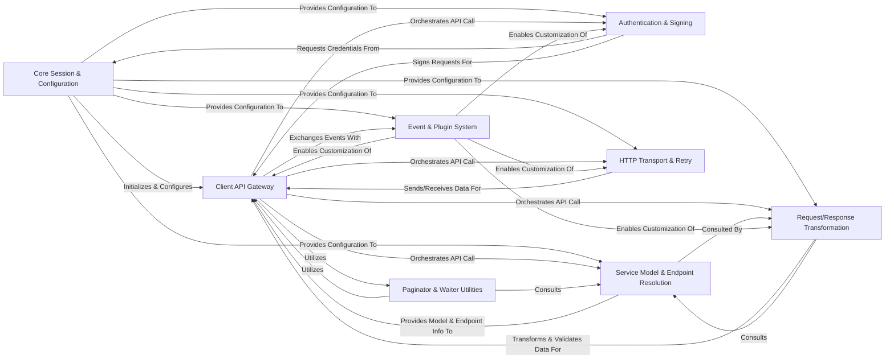

## Details

Botocore's architecture is centered around a `Core Session & Configuration` component that initializes and manages the lifecycle of other modules. The `Client API Gateway` acts as the primary entry point for AWS service interactions, orchestrating requests by leveraging specialized components. `Authentication & Signing` secures requests, while `Service Model & Endpoint Resolution` provides API definitions and routing. Data is prepared and parsed by `Request/Response Transformation`, and network communication is handled by `HTTP Transport & Retry`. A flexible `Event & Plugin System` enables extensive customization and inter-component communication. Finally, `Paginator & Waiter Utilities` offer high-level abstractions for common API patterns. This modular design ensures a robust, extensible, and efficient framework for interacting with AWS services.

### Core Session & Configuration [[Expand]](./Core_Session_Configuration.md)
The foundational component responsible for initializing the Botocore environment, loading and merging configurations from various sources, and managing the lifecycle of other Botocore components. It acts as the central hub for global settings and component instantiation.

**Related Classes/Methods**:

- <a href="https://github.com/boto/botocore/blob/develop/botocore/session.py" target="_blank" rel="noopener noreferrer">`botocore.session`</a>
- <a href="https://github.com/boto/botocore/blob/develop/botocore/configloader.py" target="_blank" rel="noopener noreferrer">`botocore.configloader`</a>
- <a href="https://github.com/boto/botocore/blob/develop/botocore/args.py" target="_blank" rel="noopener noreferrer">`botocore.args`</a>
- <a href="https://github.com/boto/botocore/blob/develop/botocore/config.py" target="_blank" rel="noopener noreferrer">`botocore.config`</a>

### Client API Gateway [[Expand]](./Client_API_Gateway.md)
The primary user-facing component that exposes AWS service operations as Python methods. It orchestrates the entire request-response lifecycle, delegating specific tasks to internal components and serving as the central coordinator for API calls.

**Related Classes/Methods**:

- <a href="https://github.com/boto/botocore/blob/develop/botocore/client.py" target="_blank" rel="noopener noreferrer">`botocore.client`</a>

### Authentication & Signing [[Expand]](./Authentication_Signing.md)
Manages the retrieval, caching, and refreshing of AWS access credentials and authentication tokens. It is also responsible for cryptographically signing outgoing AWS requests according to various AWS signing protocols (e.g., Signature Version 4), ensuring secure communication.

**Related Classes/Methods**:

- <a href="https://github.com/boto/botocore/blob/develop/botocore/credentials.py" target="_blank" rel="noopener noreferrer">`botocore.credentials`</a>
- <a href="https://github.com/boto/botocore/blob/develop/botocore/tokens.py" target="_blank" rel="noopener noreferrer">`botocore.tokens`</a>
- <a href="https://github.com/boto/botocore/blob/develop/botocore/auth.py" target="_blank" rel="noopener noreferrer">`botocore.auth`</a>
- <a href="https://github.com/boto/botocore/blob/develop/botocore/signers.py" target="_blank" rel="noopener noreferrer">`botocore.signers`</a>
- <a href="https://github.com/boto/botocore/blob/develop/botocore/crt/auth.py" target="_blank" rel="noopener noreferrer">`botocore.crt.auth`</a>

### Service Model & Endpoint Resolution [[Expand]](./Service_Model_Endpoint_Resolution.md)
Contains the programmatic representation of AWS service APIs (operations, data types, errors) and determines the correct AWS service endpoint URL and associated metadata (e.g., signing region, signing name) for a given service, region, and operation.

**Related Classes/Methods**:

- <a href="https://github.com/boto/botocore/blob/develop/botocore/model.py" target="_blank" rel="noopener noreferrer">`botocore.model`</a>
- <a href="https://github.com/boto/botocore/blob/develop/botocore/regions.py" target="_blank" rel="noopener noreferrer">`botocore.regions`</a>
- <a href="https://github.com/boto/botocore/blob/develop/botocore/endpoint_provider.py" target="_blank" rel="noopener noreferrer">`botocore.endpoint_provider`</a>
- <a href="https://github.com/boto/botocore/blob/develop/botocore/discovery.py" target="_blank" rel="noopener noreferrer">`botocore.discovery`</a>
- <a href="https://github.com/boto/botocore/blob/develop/botocore/data" target="_blank" rel="noopener noreferrer">`botocore.data`</a>

### Request/Response Transformation [[Expand]](./Request_Response_Transformation.md)
Handles the serialization of Python input parameters into the specific wire format required by the AWS service API (e.g., JSON, XML). It also parses raw HTTP responses from AWS services into structured Python objects and validates input parameters against the service model's requirements.

**Related Classes/Methods**:

- <a href="https://github.com/boto/botocore/blob/develop/botocore/serialize.py" target="_blank" rel="noopener noreferrer">`botocore.serialize`</a>
- <a href="https://github.com/boto/botocore/blob/develop/botocore/parsers.py" target="_blank" rel="noopener noreferrer">`botocore.parsers`</a>
- <a href="https://github.com/boto/botocore/blob/develop/botocore/eventstream.py" target="_blank" rel="noopener noreferrer">`botocore.eventstream`</a>
- <a href="https://github.com/boto/botocore/blob/develop/botocore/validate.py" target="_blank" rel="noopener noreferrer">`botocore.validate`</a>

### HTTP Transport & Retry [[Expand]](./HTTP_Transport_Retry.md)
Manages the actual transmission of HTTP requests and reception of HTTP responses over the network, handling low-level concerns like connection pooling, proxies, and SSL/TLS. It also implements the logic for retrying failed API calls based on configured retry policies.

**Related Classes/Methods**:

- <a href="https://github.com/boto/botocore/blob/develop/botocore/httpsession.py" target="_blank" rel="noopener noreferrer">`botocore.httpsession`</a>
- <a href="https://github.com/boto/botocore/blob/develop/botocore/awsrequest.py" target="_blank" rel="noopener noreferrer">`botocore.awsrequest`</a>
- <a href="https://github.com/boto/botocore/blob/develop/botocore/retryhandler.py" target="_blank" rel="noopener noreferrer">`botocore.retryhandler`</a>
- <a href="https://github.com/boto/botocore/blob/develop/botocore/retries/standard.py" target="_blank" rel="noopener noreferrer">`botocore.retries.standard`</a>
- <a href="https://github.com/boto/botocore/blob/develop/botocore/retries/adaptive.py" target="_blank" rel="noopener noreferrer">`botocore.retries.adaptive`</a>
- <a href="https://github.com/boto/botocore/blob/develop/botocore/retries/throttling.py" target="_blank" rel="noopener noreferrer">`botocore.retries.throttling`</a>

### Event & Plugin System [[Expand]](./Event_Plugin_System.md)
A publish-subscribe mechanism that allows internal components and external plugins to register handlers for various events occurring throughout the request-response lifecycle. This provides crucial extensibility points for customizing Botocore's behavior.

**Related Classes/Methods**:

- <a href="https://github.com/boto/botocore/blob/develop/botocore/hooks.py" target="_blank" rel="noopener noreferrer">`botocore.hooks`</a>

### Paginator & Waiter Utilities [[Expand]](./Paginator_Waiter_Utilities.md)
Provides abstractions for iterating over paginated AWS API responses, automatically handling subsequent API calls to retrieve all results. It also includes utilities for waiting on specific resource states.

**Related Classes/Methods**:

- <a href="https://github.com/boto/botocore/blob/develop/botocore/paginate.py" target="_blank" rel="noopener noreferrer">`botocore.paginate`</a>
- <a href="https://github.com/boto/botocore/blob/develop/botocore/waiter.py" target="_blank" rel="noopener noreferrer">`botocore.waiter`</a>

### [FAQ](https://github.com/CodeBoarding/GeneratedOnBoardings/tree/main?tab=readme-ov-file#faq)