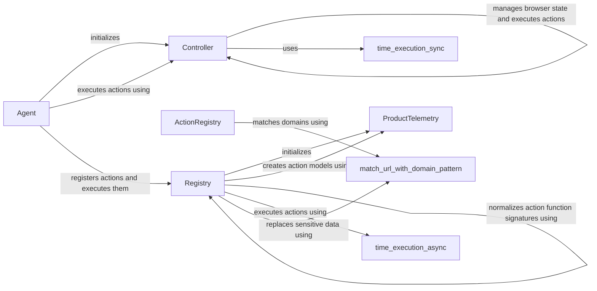

## Component Details

The Action Execution & Registry subsystem is responsible for managing and executing actions within the browser automation framework. It provides a structured way to define, register, and execute actions, ensuring that the agent can interact with web pages effectively. The core components work together to handle action registration, execution, and telemetry, providing a robust and extensible system for browser automation.

### Controller
The Controller service is the central component for managing the browser state and executing actions. It initializes the browser environment, including the accessibility tree and drag-and-drop functionality. The `act` method is the primary interface for performing actions in the browser, coordinating with other components to achieve the desired outcome.
- **Related Classes/Methods**: `browser_use.controller.service.Controller`

### ActionRegistry
The ActionRegistry manages the available actions that can be performed in the browser. It maintains a list of registered actions and provides methods for retrieving action descriptions and matching actions to specific domains and pages. This component is crucial for enabling the agent to discover and select appropriate actions based on the current context.
- **Related Classes/Methods**: `browser_use.controller.registry.views.ActionRegistry`

### Registry
The Registry service handles the registration and execution of actions. It normalizes action function signatures, replaces sensitive data, and logs data usage. It also creates action models for telemetry purposes, providing valuable insights into action performance and usage patterns. The Registry acts as an intermediary between the ActionRegistry and the Controller, ensuring that actions are executed correctly and efficiently.
- **Related Classes/Methods**: `browser_use.controller.registry.service.Registry`

### Agent
The Agent service orchestrates the interaction with the browser. It initializes the Controller and sets up action models. It provides the `step` and `multi_act` methods to execute actions in the browser based on agent logic. The Agent uses the Registry to register and execute actions.
- **Related Classes/Methods**: `browser_use.agent.service.Agent`

### ProductTelemetry
The ProductTelemetry service captures telemetry data related to action execution and registration. It is used by the Registry service to track usage and performance, providing valuable insights for improving the browser automation framework. This component helps to monitor and optimize the system's performance and identify potential issues.
- **Related Classes/Methods**: `browser_use.telemetry.service.ProductTelemetry`

### time_execution_sync
Utility function to measure the execution time of synchronous functions. This is used to measure the performance of different actions.
- **Related Classes/Methods**: `browser_use.utils.time_execution_sync`

### time_execution_async
Utility function to measure the execution time of asynchronous functions. This is used to measure the performance of different actions.
- **Related Classes/Methods**: `browser_use.utils.time_execution_async`

### match_url_with_domain_pattern
Utility function to match a URL with a domain pattern. This is used to determine which actions are available on a given page.
- **Related Classes/Methods**: `browser_use.utils.match_url_with_domain_pattern`