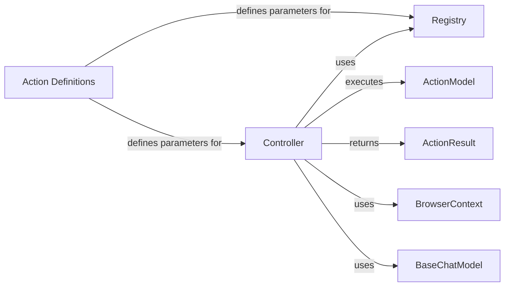

## Component Details

### Controller
The Controller service acts as the central orchestrator for executing actions within the browser. It receives action requests, interacts with the Registry to manage and execute these actions, and utilizes the BrowserContext to perform the actions in the browser. It also uses a language model to extract page content. The Controller returns the result of the action execution.
- **Related Classes/Methods**: `browser_use.controller.service.Controller`

### Registry
The Registry service is responsible for managing and executing actions. It maintains a collection of available actions, creates parameter models for these actions, and executes them asynchronously. It also handles sensitive data replacement in action parameters. The Registry is used by the Controller to manage and execute actions.
- **Related Classes/Methods**: `browser_use.controller.registry.service.Registry`

### ActionModel
ActionModel represents the action to be performed, containing the action name and parameters. It serves as the input data structure for the Controller's `act` method, providing the necessary information for action execution.
- **Related Classes/Methods**: `browser_use.agent.views.ActionModel`

### ActionResult
ActionResult represents the outcome of an action executed by the Controller. It encapsulates information about the success or failure of the action, along with any relevant data produced during execution. The Controller's `act` method returns an ActionResult to communicate the result of the action.
- **Related Classes/Methods**: `browser_use.agent.views.ActionResult`

### BrowserContext
BrowserContext provides an interface for interacting with the browser, managing pages, tabs, and browser state. It is passed to the Controller's action execution methods, enabling the Controller to manipulate the browser environment.
- **Related Classes/Methods**: `browser_use.browser.context.BrowserContext`

### BaseChatModel
BaseChatModel is an abstract class representing a language model, used for page content extraction. It's passed to the Controller's `act` method, allowing the Controller to leverage language models for tasks such as understanding page content.
- **Related Classes/Methods**: `langchain_core.language_models.chat_models.BaseChatModel`

### Action Definitions
Action Definitions (e.g., GoToUrlAction, ClickElementAction) are classes that define the structure of parameters for specific actions. They are used by the Registry to create parameter models and by the Controller to execute actions, ensuring that actions are performed with the correct parameters.
- **Related Classes/Methods**: `browser_use.controller.views`
