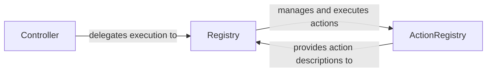

## Component Details

The Action Execution component orchestrates the execution of actions determined by the agent. It involves the Controller receiving requests, the Registry managing and executing actions, and the ActionRegistry providing action descriptions. The flow starts with a request to the Controller, which then uses the Registry to find and execute the appropriate action based on descriptions from the ActionRegistry. Sensitive data replacement is also handled within this flow.

### Controller
The Controller service is the entry point for action execution requests. It receives requests, validates them, and delegates the actual execution to the Registry service. It acts as an interface between the external world and the internal action execution mechanism.
- **Related Classes/Methods**: `browser_use.controller.service.Controller`

### Registry
The Registry service is responsible for managing and executing actions. It receives action requests from the Controller, retrieves action descriptions from the ActionRegistry, handles sensitive data replacement, and orchestrates the execution of the action. It serves as the central point for action execution logic.
- **Related Classes/Methods**: `browser_use.controller.registry.service.Registry`

### ActionRegistry
The ActionRegistry maintains a catalog of available actions and their descriptions. It provides a way for the Registry to retrieve prompt descriptions for actions, enabling dynamic action execution based on agent requests. It is the source of truth for available actions and their metadata.
- **Related Classes/Methods**: `browser_use.controller.registry.views.ActionRegistry`
