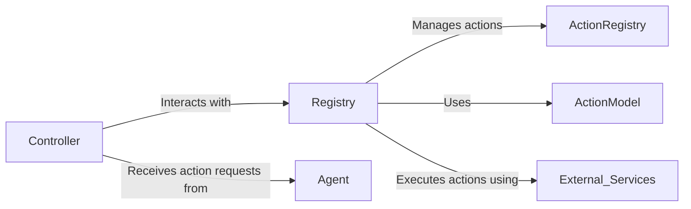

## Component Details

The Action Execution component orchestrates the execution of actions requested by the agent. It leverages the Registry to manage and execute actions, ensuring proper normalization, security, and interaction with external services. The Controller receives action requests, the Registry handles action management and execution, and the ActionModel defines the structure for representing actions.

### Controller
The Controller service is the entry point for action execution. It receives action requests from the agent, retrieves the corresponding action from the Registry, and orchestrates its execution. It handles request validation and error handling.
- **Related Classes/Methods**: `browser_use.controller.service.Controller`

### Registry
The Registry service is responsible for managing available actions, normalizing their signatures, executing them, and handling sensitive data. It acts as a central point for action management and execution, providing a secure and consistent interface for action execution.
- **Related Classes/Methods**: `browser_use.controller.registry.service.Registry`

### ActionRegistry
The ActionRegistry (views) is responsible for storing and managing available actions. It provides methods for matching actions to domains and retrieving action descriptions. It provides an interface to view and manage registered actions.
- **Related Classes/Methods**: `browser_use.controller.registry.views.ActionRegistry`

### ActionModel
ActionModel defines the structure for representing actions, including their name, description, and function signature. It's used by the Registry for action management and provides a consistent way to represent actions throughout the system.
- **Related Classes/Methods**: `browser_use.controller.registry.service.Registry`