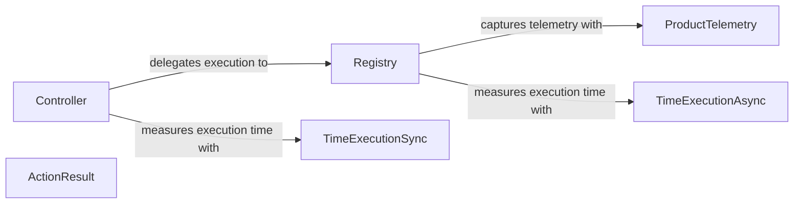

## Component Details

The Action Processing component orchestrates the execution of actions received from an agent within a browser environment. It leverages a central Controller to receive action requests, which are then delegated to a Registry for processing. The Registry manages action registration, normalization, and execution, while also interacting with a ProductTelemetry service to capture usage data. Utility functions like time_execution_async and time_execution_sync are used to measure action execution times. The component ensures actions are executed efficiently and their performance is tracked for analysis and improvement.

### Controller
The Controller component is the entry point for action requests. It receives actions, initializes the execution environment, and delegates the action execution to the Registry.
- **Related Classes/Methods**: `browser_use.controller.service.Controller`, `browser_use.controller.service.Controller:act`

### Registry
The Registry component manages the registration and execution of actions. It normalizes action signatures, executes actions, replaces sensitive data, and interacts with the ProductTelemetry service to track action usage.
- **Related Classes/Methods**: `browser_use.controller.registry.service.Registry`, `browser_use.controller.registry.service.Registry:action`, `browser_use.controller.registry.service.Registry:execute_action`

### ProductTelemetry
The ProductTelemetry component captures telemetry data related to action registration and usage. It provides methods for capturing events and tracking registered functions, enabling performance monitoring and analysis.
- **Related Classes/Methods**: `browser_use.telemetry.service.ProductTelemetry`

### ActionResult
The ActionResult component represents the outcome of an action execution. It encapsulates the result of the action and any relevant data, providing a standardized way to communicate the execution status.
- **Related Classes/Methods**: `browser_use.agent.views.ActionResult`

### TimeExecutionAsync
The TimeExecutionAsync component is a utility function that measures the execution time of an asynchronous function. It provides insights into the performance of asynchronous actions.
- **Related Classes/Methods**: `browser_use.utils.time_execution_async`

### TimeExecutionSync
The TimeExecutionSync component is a utility function that measures the execution time of a synchronous function. It provides insights into the performance of synchronous actions.
- **Related Classes/Methods**: `browser_use.utils.time_execution_sync`