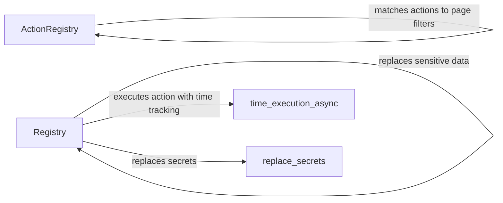

## Component Details

### ActionRegistry
The ActionRegistry stores and retrieves actions based on domain or page filters. It provides methods to match actions to specific domains or page filters, enabling the system to select the appropriate action for a given context. It also provides a method to get a prompt description of the actions for the LLM.
- **Related Classes/Methods**: `/home/ivan/StartUp/CodeBoarding/repos/browser-use/browser_use/controller/registry/views.py.ActionRegistry`, `/home/ivan/StartUp/CodeBoarding/repos/browser-use/browser_use/controller/registry/views.py.ActionRegistry._match_domains`, `/home/ivan/StartUp/CodeBoarding/repos/browser-use/browser_use/controller/registry/views.py.ActionRegistry._match_page_filter`, `/home/ivan/StartUp/CodeBoarding/repos/browser-use/browser_use/controller/registry/views.py.ActionRegistry.get_prompt_description`

### Registry
The Registry service manages and executes actions. It handles action registration, creates parameter models for actions, executes actions while tracking execution time, and replaces sensitive data within the action execution process to ensure security.
- **Related Classes/Methods**: `/home/ivan/StartUp/CodeBoarding/repos/browser-use/browser_use/controller/registry/service.py.Registry`, `/home/ivan/StartUp/CodeBoarding/repos/browser-use/browser_use/controller/registry/service.py.Registry.action`, `/home/ivan/StartUp/CodeBoarding/repos/browser-use/browser_use/controller/registry/service.py.Registry.execute_action`, `/home/ivan/StartUp/CodeBoarding/repos/browser-use/browser_use/controller/registry/service.py.Registry._create_param_model`, `/home/ivan/StartUp/CodeBoarding/repos/browser-use/browser_use/controller/registry/service.py.Registry._replace_sensitive_data`

### time_execution_async
The `time_execution_async` utility function measures the execution time of asynchronous functions. It wraps the execution of an action and provides timing information.
- **Related Classes/Methods**: `browser_use.utils.time_execution_async`

### replace_secrets
The `replace_secrets` function replaces sensitive data within the action execution process.
- **Related Classes/Methods**: `/home/ivan/StartUp/CodeBoarding/repos/browser-use/browser_use/controller/registry/service.py.Registry._replace_sensitive_data.replace_secrets`
