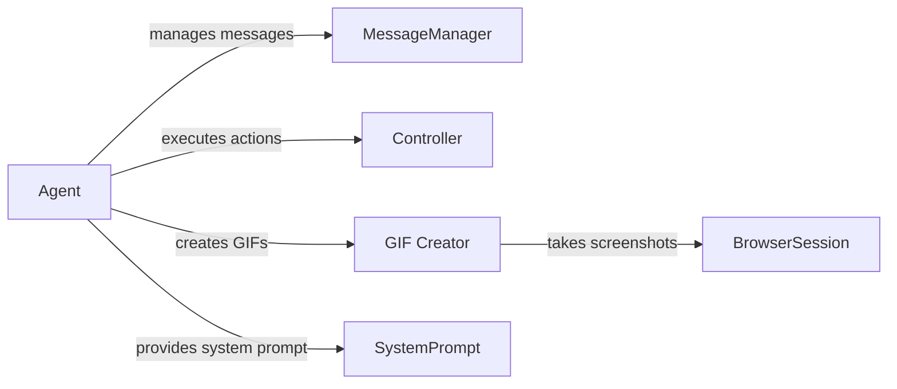

## Component Details

The Agent Core orchestrates the execution of user tasks by planning actions, interacting with the browser, and managing conversation history. It leverages a language model to determine the next action, interacts with the Controller to execute actions in the browser, and uses the MessageManager to maintain a record of the interaction. The GIF Creator captures the agent's actions visually, while the BrowserSession provides the interface to the browser. The SystemPrompt provides the initial instructions to the agent.

### Agent
The Agent is the central orchestrator, responsible for initializing action models, managing tasks, stepping through actions, and handling errors. It interacts with the MessageManager to manage conversation history, the Controller to execute actions, the GIF Creator to create GIFs, and the SystemPrompt to get initial instructions.
- **Related Classes/Methods**: `browser_use.agent.service.Agent`

### MessageManager
The MessageManager manages the conversation history, adding new tasks, state messages, model outputs, and tool messages. It filters sensitive data, counts tokens, and cuts messages to manage token limits. It interacts with the Agent to store and retrieve messages.
- **Related Classes/Methods**: `browser_use.agent.message_manager.service.MessageManager`

### Controller
The Controller executes actions in the browser. The Agent calls the Controller's `act` method to perform actions.
- **Related Classes/Methods**: `browser_use.controller.service.Controller`

### GIF Creator
The GIF Creator creates animated GIFs of the agent's actions by taking screenshots of the browser state and adding overlays. It interacts with the BrowserSession to take screenshots.
- **Related Classes/Methods**: `browser_use.agent.gif`

### BrowserSession
The BrowserSession manages the browser instance. The GIF Creator uses it to take screenshots.
- **Related Classes/Methods**: `browser_use.browser_use.browser.session.BrowserSession`

### SystemPrompt
The SystemPrompt defines the initial prompt for the agent, providing the agent with initial instructions and context.
- **Related Classes/Methods**: `browser_use.agent.prompts.SystemPrompt`