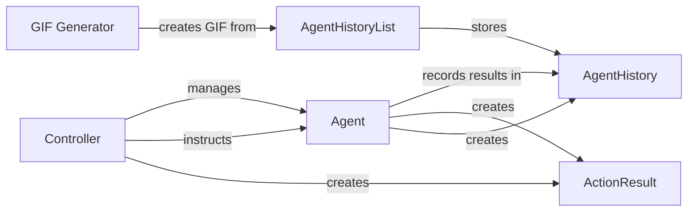

## Component Details

### Controller
The Controller component manages the Agent's lifecycle and instructs it to perform actions. It serves as the entry point for controlling the browser agent.
- **Related Classes/Methods**: `browser_use.controller.service.Controller`

### Agent
The Agent component interacts with the browser, executes instructions received from the Controller, and records the history of actions and their results.
- **Related Classes/Methods**: `browser_use.agent.service.Agent`

### ActionResult
The ActionResult component represents the result of a single action performed by the agent, storing information about its success, errors, and returned data.
- **Related Classes/Methods**: `browser_use.agent.views.ActionResult`

### AgentHistory
The AgentHistory component represents a single step in the agent's history, storing the action performed and its result.
- **Related Classes/Methods**: `browser_use.agent.views.AgentHistory`

### AgentHistoryList
The AgentHistoryList component represents the entire history of actions performed by the agent, storing a list of AgentHistory objects and providing methods for accessing and manipulating the history.
- **Related Classes/Methods**: `browser_use.agent.views.AgentHistoryList`

### GIF Generator
The GIF Generator component creates a GIF animation of the agent's history, providing a visual representation of the agent's actions over time.
- **Related Classes/Methods**: `browser_use.agent.gif`
