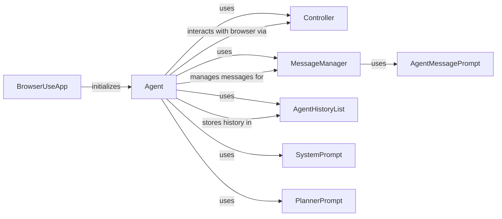

## Component Details

The Agent Orchestration & Planning component is responsible for managing the agent's lifecycle, planning actions, and coordinating with other components to achieve the desired task. It acts as the central control point, receiving tasks, generating plans using LLMs, executing actions via the Controller, and maintaining a history of interactions. The Agent orchestrates the entire browser automation process, making decisions about which actions to take and when, based on the current state and the overall goal.

### BrowserUseApp
The BrowserUseApp serves as the entry point for initiating browser automation tasks. It receives a task from the user, sets up the necessary environment, and then delegates the task execution to the Agent.
- **Related Classes/Methods**: `browser_use.browser_use.cli.BrowserUseApp:run_task`

### Agent
The Agent is the core orchestrator of the browser automation process. It manages the agent's state, interacts with the LLM for planning, executes actions in the browser via the Controller, and maintains a history of interactions using the AgentHistoryList. It receives tasks from the BrowserUseApp, plans and executes actions, and handles errors.
- **Related Classes/Methods**: `browser_use.agent.service.Agent`, `browser_use.agent.service.Agent:add_new_task`, `browser_use.agent.service.Agent:run`, `browser_use.agent.service.Agent:step`, `browser_use.agent.service.Agent:_handle_step_error`, `browser_use.agent.service.Agent:_make_history_item`, `browser_use.agent.service.Agent:get_next_action`, `browser_use.agent.service.Agent:_log_agent_event`, `browser_use.agent.service.Agent:multi_act`, `browser_use.agent.service.Agent:_validate_output`, `browser_use.agent.service.Agent:rerun_history`, `browser_use.agent.service.Agent:_run_planner`

### Controller
The Controller provides an interface for the Agent to interact with the browser. It receives actions from the Agent and executes them in the browser environment, returning the results to the Agent.
- **Related Classes/Methods**: `browser_use.controller.service.Controller`, `browser_use.controller.service.Controller:act`

### MessageManager
The MessageManager is responsible for managing the messages exchanged between the Agent and the LLM. It adds new messages, retrieves messages, and cuts messages to stay within token limits, ensuring efficient communication with the LLM.
- **Related Classes/Methods**: `browser_use.agent.message_manager.service.MessageManager`, `browser_use.agent.message_manager.service.MessageManager:add_new_task`, `browser_use.agent.message_manager.service.MessageManager:add_state_message`, `browser_use.agent.message_manager.service.MessageManager:add_model_output`, `browser_use.agent.message_manager.service.MessageManager:add_plan`, `browser_use.agent.message_manager.service.MessageManager:get_messages`, `browser_use.agent.message_manager.service.MessageManager:_add_message_with_tokens`, `browser_use.agent.message_manager.service.MessageManager:cut_messages`, `browser_use.agent.message_manager.service.MessageManager:add_tool_message`

### AgentHistoryList
The AgentHistoryList stores the history of agent actions and results. It provides methods for saving the history to a file and accessing action names, allowing for debugging and replaying of agent actions.
- **Related Classes/Methods**: `browser_use.agent.views.AgentHistoryList`, `browser_use.agent.views.AgentHistoryList:__str__`, `browser_use.agent.views.AgentHistoryList:__repr__`, `browser_use.agent.views.AgentHistoryList:save_to_file`, `browser_use.agent.views.AgentHistoryList:has_errors`, `browser_use.agent.views.AgentHistoryList:action_names`, `browser_use.agent.views.AgentHistoryList:model_actions_filtered`

### SystemPrompt
The SystemPrompt component manages the system prompt used by the agent. It loads the prompt template and provides a method for getting the system message, which guides the LLM's behavior.
- **Related Classes/Methods**: `browser_use.agent.prompts.SystemPrompt`, `browser_use.agent.prompts.SystemPrompt:__init__`, `browser_use.agent.prompts.SystemPrompt.get_system_message`

### AgentMessagePrompt
The AgentMessagePrompt component manages the user message prompt used by the agent. It provides a method for getting the user message, which provides context to the LLM.
- **Related Classes/Methods**: `browser_use.agent.prompts.AgentMessagePrompt`, `browser_use.agent.prompts.AgentMessagePrompt.get_user_message`

### PlannerPrompt
The PlannerPrompt component manages the planner prompt used by the agent. It loads the prompt template and provides a method for getting the system message, which guides the LLM's planning process.
- **Related Classes/Methods**: `browser_use.agent.prompts.PlannerPrompt`, `browser_use.agent.prompts.PlannerPrompt.get_system_message`