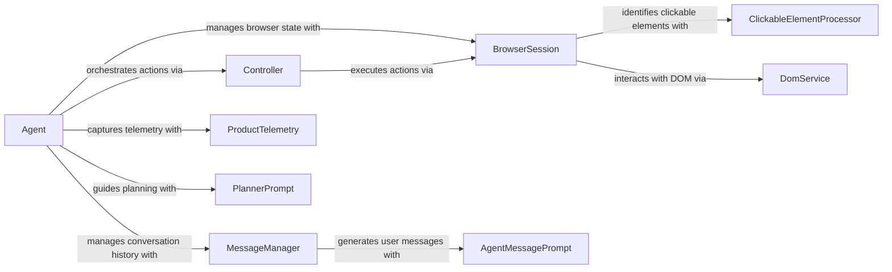

## Component Details

The Agent Orchestration & Planning component is responsible for managing the overall browser automation process. It acts as the central control point, coordinating the activities of other components to achieve the user's goals. The Agent plans actions, executes them through the Controller, and maintains a conversation history using the MessageManager. It interacts with the BrowserSession to manage the browser's state and ProductTelemetry to capture usage data. The core flow involves receiving a user request, planning a series of actions, executing those actions in the browser, and providing feedback to the user. This process is repeated until the user's goal is achieved.

### Agent
The Agent is the central orchestrator, responsible for planning actions, executing them through the Controller, and managing the conversation history using the MessageManager. It also interacts with the BrowserSession to manage the browser's state and ProductTelemetry to capture usage data.
- **Related Classes/Methods**: `browser_use.agent.service.Agent`, `browser-use/browser_use/agent/service.py`

### Controller
The Controller executes actions in the browser, receiving instructions from the Agent and using the BrowserSession to perform them. It acts as an intermediary between the Agent's planned actions and the actual browser interaction.
- **Related Classes/Methods**: `browser_use.controller.service.Controller`

### MessageManager
The MessageManager maintains the conversation history between the agent and the user, storing messages, plans, and tool outputs. It uses AgentMessagePrompt to generate user messages and manages token counts to optimize LLM usage.
- **Related Classes/Methods**: `browser_use.agent.message_manager.service.MessageManager`, `browser-use/browser_use/agent/message_manager/service.py`

### BrowserSession
The BrowserSession manages the state of the browser, including the DOM and cookies. It provides methods for interacting with the browser and retrieving its state. It uses ClickableElementProcessor and DomService to interact with the DOM.
- **Related Classes/Methods**: `browser_use.browser.session.BrowserSession`, `browser-use/browser_use/browser/session.py`

### ProductTelemetry
ProductTelemetry captures telemetry data about the agent's usage, such as events and performance metrics, providing insights into the agent's behavior and performance.
- **Related Classes/Methods**: `browser_use.telemetry.service.ProductTelemetry`

### AgentMessagePrompt
AgentMessagePrompt is responsible for generating user messages based on the agent's state and the current task, ensuring clear and informative communication with the user.
- **Related Classes/Methods**: `browser_use.agent.prompts.AgentMessagePrompt`

### PlannerPrompt
PlannerPrompt provides the system message for the planner, which guides the agent in planning its actions, ensuring a structured and goal-oriented approach.
- **Related Classes/Methods**: `browser_use.agent.prompts.PlannerPrompt`

### ClickableElementProcessor
ClickableElementProcessor is responsible for identifying clickable elements in the DOM, allowing the agent to interact with the browser by clicking on relevant elements.
- **Related Classes/Methods**: `browser_use.dom.clickable_element_processor.service.ClickableElementProcessor`

### DomService
DomService provides methods for interacting with the DOM, such as getting clickable elements, enabling the agent to access and manipulate the browser's content.
- **Related Classes/Methods**: `browser_use.dom.service.DomService`