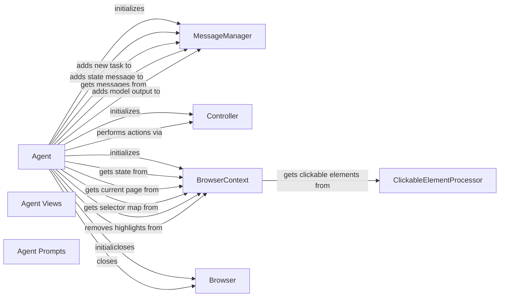

## Component Details

The Agent Orchestration component manages the overall task flow by planning and executing browser interactions. It uses an LLM to determine the next action based on the current browser state and task objectives. The Agent orchestrates the interaction between the LLM, browser, and message history to achieve the desired task.

### Agent
The Agent class is the central component responsible for managing the interaction with the browser. It initializes the browser, sets up the action models, and runs the main loop for executing tasks. It uses the MessageManager to keep track of the conversation history and the Controller to interact with the browser.
- **Related Classes/Methods**: `browser_use.agent.service.Agent`, `browser-use/browser_use/agent/service.py.Agent._setup_action_models`, `browser-use/browser_use/agent/service.py.Agent.get_next_action`, `browser-use/browser_use/agent/service.py.Agent.close`

### MessageManager
The MessageManager class manages the messages exchanged between the agent and the LLM. It stores the messages, adds new messages, and cuts messages when the token limit is reached. It also filters sensitive data from the messages.
- **Related Classes/Methods**: `browser_use.agent.message_manager.service.MessageManager`, `browser-use/browser_use/agent/message_manager/service.py.MessageManagerSettings`, `browser-use/browser_use/agent/message_manager/service.py.MessageManager._add_message_with_tokens`, `browser-use/browser_use/agent/message_manager/service.py.MessageManager._filter_sensitive_data`

### Controller
The Controller class is responsible for executing actions in the browser. It receives actions from the agent and uses the browser's API to perform the actions.
- **Related Classes/Methods**: `browser_use.controller.service.Controller`

### BrowserContext
The BrowserContext class manages the state of the browser. It stores the current page, the clickable elements, and the session information. It provides methods for getting the state of the browser and interacting with the browser.
- **Related Classes/Methods**: `browser_use.browser.context.BrowserContext`, `browser-use/browser_use/browser/context.py.BrowserContext.get_agent_current_page`, `browser-use/browser_use/browser/context.py.BrowserContext.get_session`

### Browser
The Browser class represents the browser instance. It provides methods for opening and closing the browser.
- **Related Classes/Methods**: `browser_use.browser.browser.Browser`, `browser-use/browser_use/browser/browser.py.BrowserConfig`, `browser-use/browser_use/browser/browser.py.Browser.close`

### ClickableElementProcessor
The ClickableElementProcessor class is responsible for extracting clickable elements from the DOM.
- **Related Classes/Methods**: `browser_use.dom.clickable_element_processor.service.ClickableElementProcessor`

### Agent Views
The Agent Views are data classes that represent the state and settings of the agent.
- **Related Classes/Methods**: `browser_use.agent.views.AgentSettings`, `browser_use.agent.views.AgentState`, `browser_use.agent.views.StepMetadata`

### Agent Prompts
The Agent Prompts are classes that generate the prompts for the LLM.
- **Related Classes/Methods**: `browser_use.agent.prompts.SystemPrompt.get_system_message`, `browser_use.agent.prompts.SystemPrompt`, `browser_use.agent.prompts.AgentMessagePrompt.get_user_message`, `browser_use.agent.prompts.AgentMessagePrompt`
