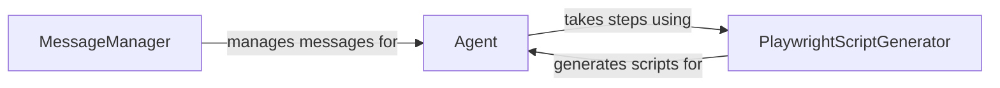

## Component Details

The Agent Orchestration component manages the planning and execution of tasks by interacting with a language model (LLM) to determine actions, managing the history of actions, and handling errors. It orchestrates the task execution flow by delegating actions to other components and managing the conversation with the user.

### Agent
The Agent class is the central component responsible for managing the interaction loop. It initializes action models, adds new tasks, steps through the tasks by getting the next action, taking the step, and handling errors. It also manages the history of interactions and can rerun or resume from previous states.
- **Related Classes/Methods**: `browser_use.agent.service.Agent`

### PlaywrightScriptGenerator
The PlaywrightScriptGenerator class is responsible for generating Playwright scripts based on the actions the agent wants to perform. It maps high-level actions like 'go to URL', 'input text', and 'click element' to corresponding Playwright script snippets.
- **Related Classes/Methods**: `browser_use.agent.playwright_script_generator.PlaywrightScriptGenerator`

### MessageManager
The MessageManager class manages the messages exchanged between the agent and the language model. It adds new tasks, state messages, model outputs, and plans to the message history. It also filters sensitive data and cuts messages to stay within token limits.
- **Related Classes/Methods**: `browser_use.agent.message_manager.service.MessageManager`
