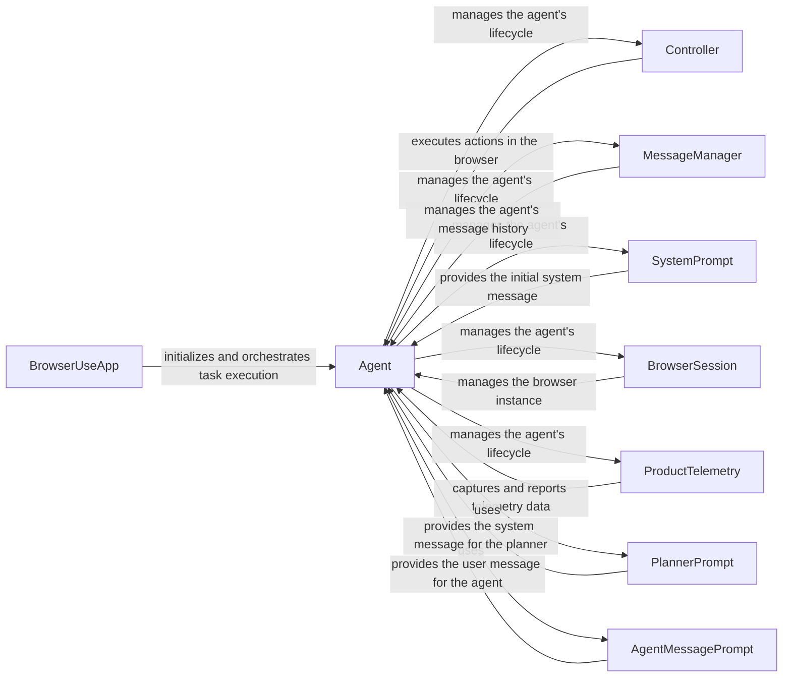

## Component Details

The Agent Orchestration component manages the overall browser automation process. It initializes and orchestrates the interaction between the language model, the browser controller, and the message manager. It is responsible for planning, executing, and validating actions, as well as maintaining the agent's history and state. The central class is the Agent, which manages the agent's lifecycle, including initialization, task execution, planning, action selection, and state management. It interacts with the LLM, browser, message manager, and telemetry services. The BrowserUseApp initializes the agent and orchestrates the task execution. The Controller executes actions in the browser environment. The MessageManager manages the agent's message history. The SystemPrompt provides the initial system message. The BrowserSession manages the browser instance. The ProductTelemetry captures and reports telemetry data.

### BrowserUseApp
The BrowserUseApp is the entry point for running tasks. It initializes the agent and orchestrates the task execution.
- **Related Classes/Methods**: `browser_use.browser_use.cli.BrowserUseApp:run_task`

### Agent
The Agent class is the central component responsible for managing the agent's lifecycle, including initialization, task execution, planning, action selection, and state management. It interacts with the LLM, browser, message manager, and telemetry services.
- **Related Classes/Methods**: `browser_use.agent.service.Agent`

### Controller
The Controller class is responsible for executing actions in the browser environment. It receives actions from the Agent and interacts with the browser to perform them.
- **Related Classes/Methods**: `browser_use.controller.service.Controller`

### MessageManager
The MessageManager class manages the agent's message history, including user inputs, model outputs, and tool messages. It provides methods for adding, retrieving, and cutting messages to maintain context within token limits.
- **Related Classes/Methods**: `browser_use.agent.message_manager.service.MessageManager`

### SystemPrompt
The SystemPrompt class provides the initial system message for the agent, setting the context and instructions for its behavior.
- **Related Classes/Methods**: `browser_use.agent.prompts.SystemPrompt`

### BrowserSession
The BrowserSession class manages the browser instance and its state, providing methods for interacting with the browser.
- **Related Classes/Methods**: `browser_use.browser.session.BrowserSession`

### ProductTelemetry
The ProductTelemetry class captures and reports telemetry data about the agent's usage and performance.
- **Related Classes/Methods**: `browser_use.telemetry.service.ProductTelemetry`

### PlannerPrompt
The PlannerPrompt class provides the system message for the planner, guiding the agent in generating a plan to achieve the given task.
- **Related Classes/Methods**: `browser_use.agent.prompts.PlannerPrompt`

### AgentMessagePrompt
The AgentMessagePrompt class provides the user message for the agent, incorporating the current state and available actions.
- **Related Classes/Methods**: `browser_use.agent.prompts.AgentMessagePrompt`