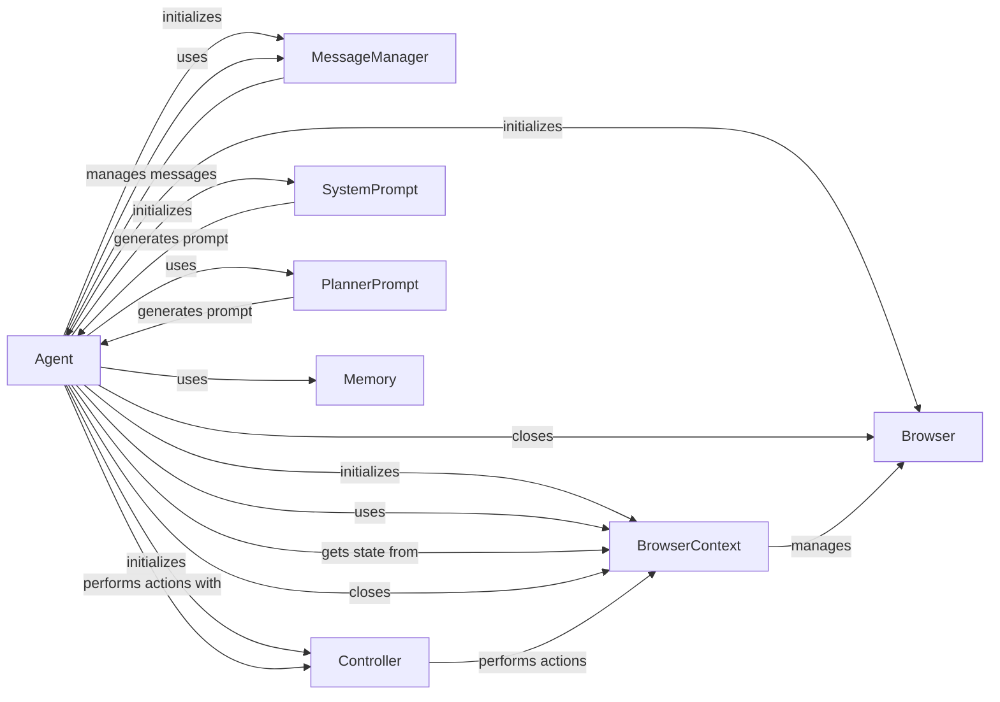

## Component Details

### Agent
The Agent class orchestrates the agent's lifecycle, managing interactions between the LLM, browser, controller, and message manager. It handles task execution, planning, memory management, and error handling, acting as the central coordinator for the entire system.
- **Related Classes/Methods**: `browser_use.agent.service.Agent`

### Browser
The Browser class manages the browser instance, handling navigation and interaction with web pages. It provides methods for creating and managing browser contexts, enabling the agent to interact with web content.
- **Related Classes/Methods**: `browser_use.browser.browser.Browser`

### BrowserContext
The BrowserContext class provides a context for the browser, managing the state of the browser and providing methods for interacting with the DOM. It handles page loading, element selection, and screenshot capture, providing a controlled environment for web interaction.
- **Related Classes/Methods**: `browser_use.browser.context.BrowserContext`

### MessageManager
The MessageManager class is responsible for managing the messages exchanged between the agent and the language model. It adds new tasks, stores messages, retrieves them for context, and manages token limits, ensuring efficient communication and context management.
- **Related Classes/Methods**: `browser_use.agent.message_manager.service.MessageManager`

### Controller
The Controller class is responsible for performing actions in the browser, such as clicking buttons and filling forms. It uses a registry of available actions and interacts with the browser context to execute them, enabling the agent to automate web interactions.
- **Related Classes/Methods**: `browser_use.controller.service.Controller`

### SystemPrompt
The SystemPrompt class is responsible for generating the system prompt for the language model. It includes information about available actions and constraints, guiding the LLM's behavior and ensuring it operates within defined boundaries.
- **Related Classes/Methods**: `browser_use.agent.prompts.SystemPrompt`

### PlannerPrompt
The PlannerPrompt class is responsible for generating the planner prompt for the language model. It is used to analyze the current state and suggest next steps, enabling the agent to plan its actions and achieve its goals effectively.
- **Related Classes/Methods**: `browser_use.agent.prompts.PlannerPrompt`

### Memory
The Memory class is responsible for managing the agent's memory, including creating procedural memory and storing information about past interactions. This allows the agent to learn from experience and improve its performance over time.
- **Related Classes/Methods**: `browser_use.agent.memory.service.Memory`
