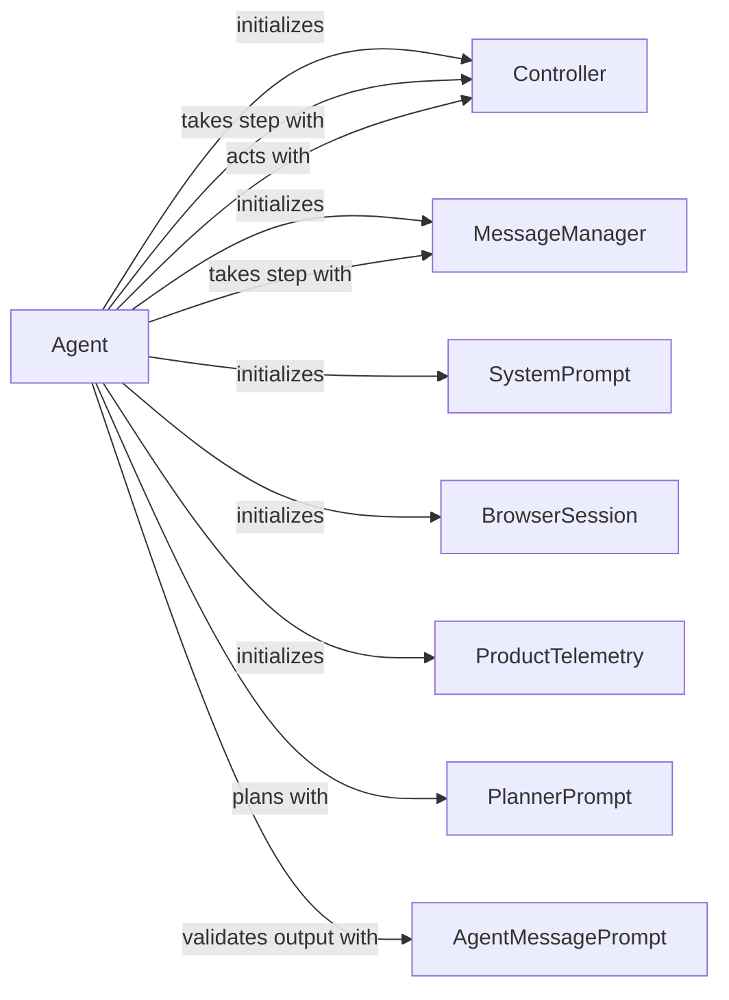

## Component Details

The Agent Service orchestrates the browser automation process. It initializes and manages the agent's state, interacts with the LLM to plan actions, and delegates action execution to the Controller Service. The service also incorporates message management, prompt generation, and telemetry logging to ensure efficient and insightful automation.

### Agent
The Agent is the central component responsible for orchestrating the browsing process. It manages the interaction with the LLM, the browser controller, and the message manager. It takes steps to achieve a goal, handles errors, and logs events.
- **Related Classes/Methods**: `browser_use.agent.service.Agent`

### MessageManager
The MessageManager manages the conversation history between the agent and the LLM. It adds new messages, retrieves existing messages, and cuts messages to stay within token limits.
- **Related Classes/Methods**: `browser_use.agent.message_manager.service.MessageManager`

### Controller
The Controller provides an interface for interacting with the browser. It performs actions such as clicking, typing, and navigating.
- **Related Classes/Methods**: `browser_use.controller.service.Controller`

### SystemPrompt
The SystemPrompt class generates the system message for the LLM, providing context and instructions for the agent.
- **Related Classes/Methods**: `browser_use.agent.prompts.SystemPrompt`

### BrowserSession
The BrowserSession class manages the browser session, including creating and closing the browser.
- **Related Classes/Methods**: `browser_use.browser.session.BrowserSession`

### ProductTelemetry
The ProductTelemetry class captures and sends telemetry data about the agent's usage.
- **Related Classes/Methods**: `browser_use.telemetry.service.ProductTelemetry`

### PlannerPrompt
The PlannerPrompt class generates the prompt for the LLM to plan the next steps.
- **Related Classes/Methods**: `browser_use.agent.prompts.PlannerPrompt`

### AgentMessagePrompt
The AgentMessagePrompt class generates the prompt for the LLM to generate the next action.
- **Related Classes/Methods**: `browser_use.agent.prompts.AgentMessagePrompt`