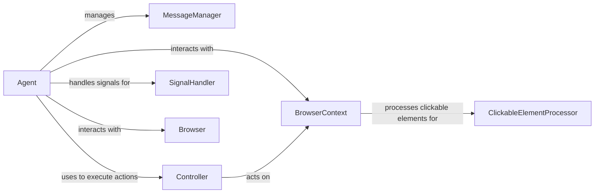

## Component Details

### Agent
The Agent is the core component responsible for managing the agent's lifecycle, planning, and interaction with the browser and LLM. It initializes the browser context, sets up action models, orchestrates task execution, and manages the agent's state. It interacts with the MessageManager for message handling, the BrowserContext for browser interaction, and the Controller for executing actions.
- **Related Classes/Methods**: `browser_use.agent.service.Agent`, `browser_use.agent.service.Agent:_run_planner`

### MessageManager
The MessageManager handles the messages exchanged between the agent and the LLM. It adds new tasks, state messages, model outputs, and plans to the message history. It also handles token counting and filtering of sensitive data. The Agent uses the MessageManager to manage the communication flow with the LLM.
- **Related Classes/Methods**: `browser_use.agent.message_manager.service.MessageManager`

### BrowserContext
The BrowserContext provides an interface for interacting with the browser. It manages the browser session and cookies, retrieves the current page, and provides methods for getting the current state and closing the browser context. The Agent uses the BrowserContext to interact with the browser, and the Controller uses it to execute actions.
- **Related Classes/Methods**: `browser_use.browser.context.BrowserContext`

### Controller
The Controller handles the execution of actions in the browser. It interacts with the BrowserContext to perform specific tasks, such as clicking elements or filling forms. The Agent uses the Controller to execute actions in the browser based on the plan generated by the LLM.
- **Related Classes/Methods**: `browser_use.controller.service.Controller`

### SignalHandler
The SignalHandler handles signals such as SIGINT and SIGTERM, allowing the agent to be paused and resumed gracefully. It ensures that the agent can be stopped without losing its state. The Agent uses the SignalHandler to handle interruptions and ensure smooth operation.
- **Related Classes/Methods**: `browser_use.utils.SignalHandler`

### ClickableElementProcessor
The ClickableElementProcessor processes the DOM to identify clickable elements and their hashes. This information is used for determining the state of the browser and identifying elements that can be interacted with. The BrowserContext uses the ClickableElementProcessor to analyze the DOM.
- **Related Classes/Methods**: `browser_use.dom.clickable_element_processor.service.ClickableElementProcessor`

### Browser
The Browser component represents the browser instance and provides methods for initializing and closing the browser. The Agent uses the Browser component to create and manage the browser instance.
- **Related Classes/Methods**: `browser_use.browser.browser.Browser`
