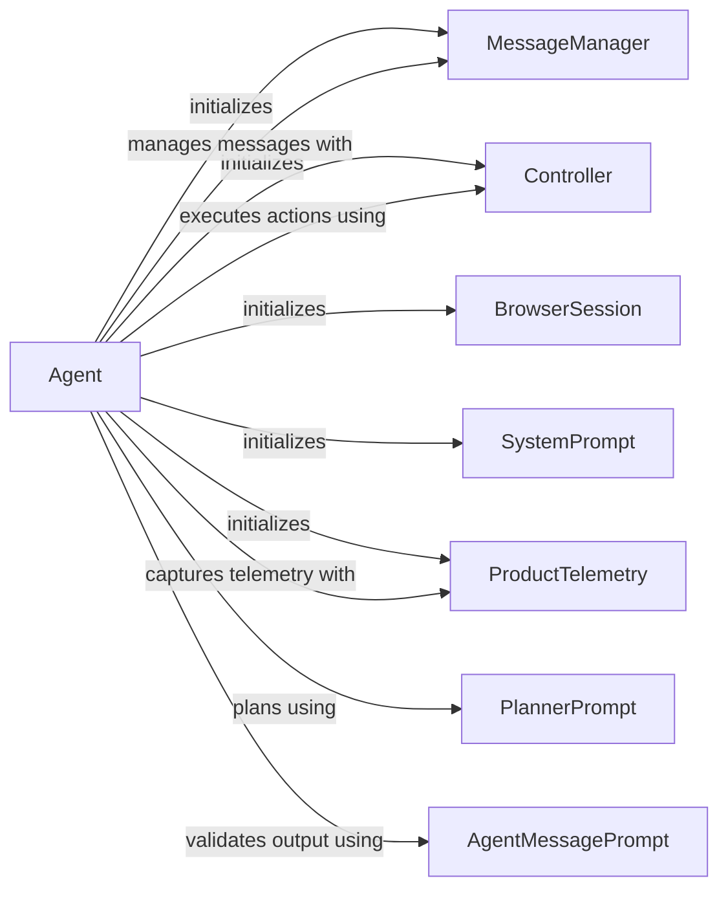

## Component Details

The Agent Service orchestrates the automation process by planning and executing tasks. It interacts with the language model, manages messages, and controls the browser. The Agent initializes and manages the lifecycle of other components, including the MessageManager, Controller, BrowserSession, and telemetry services. It uses prompts to guide planning and message generation, handles signals and exceptions, and processes the history tree to extract relevant information.

### Agent
The central component responsible for managing the agent's lifecycle, including initialization, task execution, and interaction with other components. It orchestrates planning, action execution, and observation.
- **Related Classes/Methods**: `browser_use.agent.service.Agent`

### MessageManager
Manages the conversation history between the agent and the LLM, storing, retrieving, and manipulating messages to provide context for the agent's decision-making process.
- **Related Classes/Methods**: `browser_use.agent.message_manager.service.MessageManager`, `browser_use.agent.message_manager.service.MessageManagerSettings`

### Controller
Executes actions in the browser, receiving instructions from the agent and interacting with the browser to perform the desired actions.
- **Related Classes/Methods**: `browser_use.controller.service.Controller`

### SystemPrompt
Provides the initial instructions and context to the agent, defining the agent's role, goals, and constraints.
- **Related Classes/Methods**: `browser_use.agent.prompts.SystemPrompt`

### PlannerPrompt
Generates the prompt used by the agent to plan its actions, providing context and instructions to guide the agent's planning process.
- **Related Classes/Methods**: `browser_use.agent.prompts.PlannerPrompt`

### AgentMessagePrompt
Generates the prompt used by the agent to interact with the LLM, providing context and instructions to guide the agent's message generation process.
- **Related Classes/Methods**: `browser_use.agent.prompts.AgentMessagePrompt`

### BrowserSession
Manages the browser instance used by the agent, handling browser initialization, navigation, and interaction.
- **Related Classes/Methods**: `browser_use.browser.session.BrowserSession`

### ProductTelemetry
Collects and reports telemetry data about the agent's usage, used to improve the agent's performance and identify areas for improvement.
- **Related Classes/Methods**: `browser_use.telemetry.service.ProductTelemetry`, `browser_use.telemetry.views.AgentTelemetryEvent`