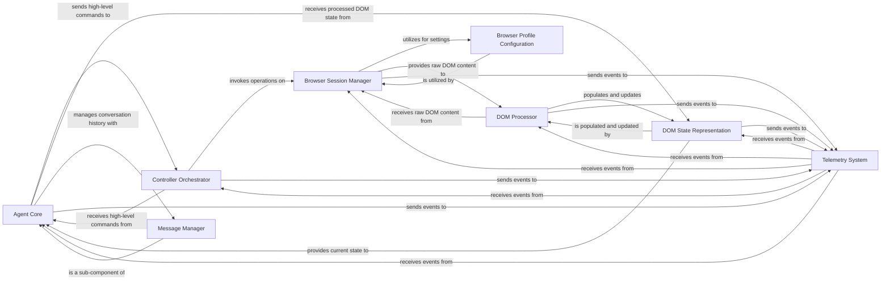

## Component Details

The `Agent Core` is the central intelligence of the application, orchestrating tasks by interacting with various components. The selection of the following components is based on their direct involvement in the agent's operational loop, from understanding the environment to executing actions and managing state. They are fundamental because they represent distinct functional areas critical for the agent's autonomous operation within a browser environment.

### Agent Core
The intelligent heart of the application, responsible for planning, executing, and managing tasks within the web browser. It interacts with the underlying Large Language Model (LLM), maintains the conversation history, and determines the necessary browser actions based on its reasoning. It orchestrates the overall task execution by leveraging other components.

**Related Classes/Methods**:

- <a href="https://github.com/browser-use/browser-use/blob/master/browser_use/agent/service.py#L0-L0" target="_blank" rel="noopener noreferrer">`browser_use.agent.service` (0:0)</a>

### Message Manager
A sub-component of the `Agent Core`, responsible for managing the conversation history and formatting messages for the LLM. It handles the input and output of the LLM, including processing tool calls and extracting relevant information from the model's responses.

**Related Classes/Methods**:

- <a href="https://github.com/browser-use/browser-use/blob/master/browser_use/agent/message_manager/service.py#L0-L0" target="_blank" rel="noopener noreferrer">`browser_use.agent.message_manager.service` (0:0)</a>

### Browser Session Manager
Manages the lifecycle of browser sessions, including launching new instances, connecting to existing ones, and maintaining the browser's context (e.g., tabs, pages). It provides the primary interface for direct browser interactions.

**Related Classes/Methods**:

- <a href="https://github.com/browser-use/browser-use/blob/master/browser_use/browser/session.py#L0-L0" target="_blank" rel="noopener noreferrer">`browser_use.browser.session.service` (0:0)</a>

### Browser Profile Configuration
Defines and applies various configurations for browser instances, such as user profiles, context arguments (color schemes, content recording), and launch parameters.

**Related Classes/Methods**:

- <a href="https://github.com/browser-use/browser-use/blob/master/browser_use/browser/profile.py#L0-L0" target="_blank" rel="noopener noreferrer">`browser_use.browser.profile.profile` (0:0)</a>

### Controller Orchestrator
Acts as an intermediary, orchestrating communication and flow between high-level commands from the `Agent Core` and low-level browser operations managed by the `Browser Session Manager`. It handles command registration and dispatch.

**Related Classes/Methods**:

- <a href="https://github.com/browser-use/browser-use/blob/master/browser_use/controller/service.py#L0-L0" target="_blank" rel="noopener noreferrer">`browser_use.controller.service` (0:0)</a>

### DOM Processor
Responsible for analyzing and processing the raw Document Object Model (DOM) of a web page. It extracts meaningful information, identifies interactive elements, and manages navigation history to provide a structured understanding of the page.

**Related Classes/Methods**:

- <a href="https://github.com/browser-use/browser-use/blob/master/browser_use/dom/service.py#L0-L0" target="_blank" rel="noopener noreferrer">`browser_use.dom.service` (0:0)</a>

### DOM State Representation
Provides a structured, simplified, and actionable representation of the current state of the web page's DOM. It's the "perception" layer for the agent, containing information about visible elements, their properties, and their relationships.

**Related Classes/Methods**:

- <a href="https://github.com/browser-use/browser-use/blob/master/browser_use/dom/views.py#L0-L0" target="_blank" rel="noopener noreferrer">`browser_use.dom.views` (0:0)</a>

### Telemetry System
Collects, logs, and reports various events and metrics throughout the system, including agent actions, browser interactions, errors, and performance data.

**Related Classes/Methods**:

- <a href="https://github.com/browser-use/browser-use/blob/master/browser_use/telemetry/service.py#L0-L0" target="_blank" rel="noopener noreferrer">`browser_use.telemetry.service` (0:0)</a>

### [FAQ](https://github.com/CodeBoarding/GeneratedOnBoardings/tree/main?tab=readme-ov-file#faq)