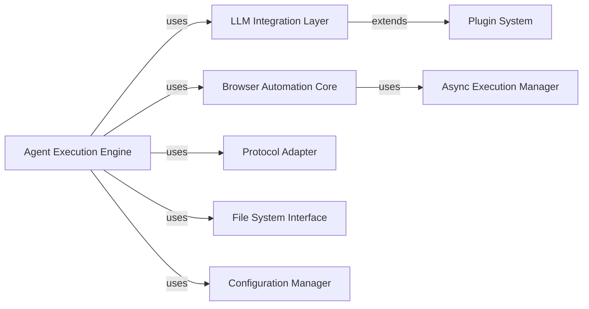

## Details

One paragraph explaining the functionality which is represented by this graph. What the main flow is and what is its purpose.

### Agent Execution Engine [[Expand]](./Agent_Execution_Engine.md)
Central AI logic orchestrating browser automation, LLM decision-making, and task planning.

**Related Classes/Methods**:

- `browser_use.agent.Agent` (10:45)
- <a href="https://github.com/browser-use/browser-use/blob/main/browser_use/browser/session.py#L205-L4684" target="_blank" rel="noopener noreferrer">`browser_use.browser.session.BrowserSession` (205:4684)</a>

### LLM Integration Layer [[Expand]](./LLM_Integration_Layer.md)
Standardized abstraction for multi-provider LLM interactions (OpenAI, etc.).

**Related Classes/Methods**:

- <a href="https://github.com/browser-use/browser-use/blob/main/browser_use/llm/base.py#L12-L60" target="_blank" rel="noopener noreferrer">`browser_use.llm.base.BaseChatModel` (12:60)</a>
- `browser_use.llm.providers.OpenAIProvider` (5:25)

### Browser Automation Core [[Expand]](./Browser_Automation_Core.md)
Playwright-based browser control and DOM manipulation engine.

**Related Classes/Methods**:

- <a href="https://github.com/browser-use/browser-use/blob/main/browser_use/browser/session.py#L205-L4684" target="_blank" rel="noopener noreferrer">`browser_use.browser.session.BrowserSession` (205:4684)</a>
- `browser_use.browser.dom.DOMElement` (3:15)

### Protocol Adapter [[Expand]](./Protocol_Adapter.md)
MCP protocol implementation for interoperability with external systems.

**Related Classes/Methods**:

- `browser_use.protocol.mcp_adapter.MCPAdapter` (20:50)
- `browser_use.mcp.server.BrowserUseServer`

### Async Execution Manager
Asyncio-based task scheduler for non-blocking browser/LLM operations.

**Related Classes/Methods**:

- `browser_use.async.task_manager.TaskManager` (10:40)

### File System Interface
Abstraction layer for persistent storage of agent states and browser profiles.

**Related Classes/Methods**:

- <a href="https://github.com/browser-use/browser-use/blob/main/browser_use/filesystem/file_system.py#L21-L77" target="_blank" rel="noopener noreferrer">`browser_use.filesystem.file_system.BaseFile` (21:77)</a>

### Plugin System
Modular extension framework for adding LLM providers and browser capabilities.

**Related Classes/Methods**:

- `browser_use.plugins.PluginLoader` (5:25)

### Configuration Manager
Runtime configuration handler for agent parameters and environment settings.

**Related Classes/Methods**:

- <a href="https://github.com/browser-use/browser-use/blob/main/browser_use/config.py#L237-L242" target="_blank" rel="noopener noreferrer">`browser_use.config.AgentEntry` (237:242)</a>

### [FAQ](https://github.com/CodeBoarding/GeneratedOnBoardings/tree/main?tab=readme-ov-file#faq)