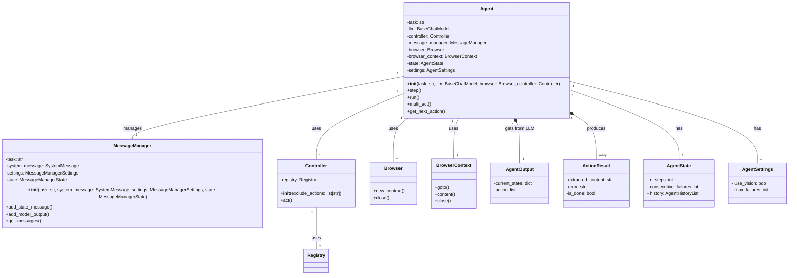

Based on the code analysis, here's a refined overview of the Agent component:

**Component Description:**

The `Agent` component is the central orchestrator for automated browsing tasks. It leverages a large language model (LLM) to plan and execute steps to achieve a given task. The agent interacts with a `Browser` to navigate web pages, a `Controller` to perform actions on those pages, and a `MessageManager` to maintain a contextual conversation with the LLM. The agent's functionality includes task initialization, step-by-step execution, error handling, and result validation. It also supports memory management, allowing it to retain and utilize information from previous steps.

**Main Classes and Their Purposes:**

*   **`Agent`**: The primary class responsible for orchestrating the browsing task. It initializes and manages the other components, interacts with the LLM to determine the next action, executes actions via the `Controller`, and manages the agent's state and memory.
*   **`MessageManager`**: Manages the conversation history with the LLM. It formats and stores messages, adds context, and trims the history to stay within token limits.
*   **`Controller`**: Provides a registry of available actions that the agent can perform in the browser. It executes these actions and returns the results.
*   **`Browser`**: An interface for interacting with a web browser. It provides methods for navigating pages, interacting with elements, and extracting content.
*   **`BrowserContext`**: Represents a browser context, which is an isolated browsing session. It manages tabs, cookies, and other session-specific data.
*   **`AgentOutput`**: A data class that defines the structure of the output from the LLM, including the current state, the next action to take, and any reasoning.
*   **`ActionResult`**: A data class that represents the result of executing an action, including any extracted content, errors, or flags indicating whether the task is done.

**Visualization:**

I will use a class diagram to represent the structure of the Agent component, highlighting the main classes and their relationships.

