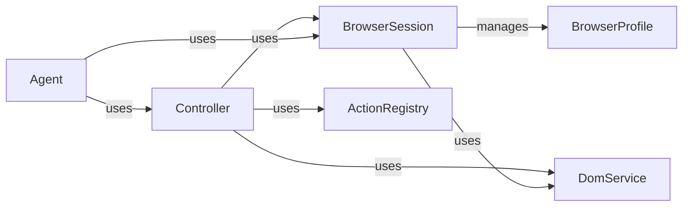

## Component Details

The Browser Automation Core provides the foundation for interacting with web browsers, enabling the agent to manipulate web pages. It manages browser sessions, processes the DOM to understand web page structure, and executes actions in the browser. The core components work together to translate high-level actions into browser operations, maintain a registry of available actions, and provide functionalities for extracting and manipulating the DOM.

### BrowserSession
Manages the browser instance using Playwright, including launching, navigating, interacting with pages, and closing the browser. It provides methods for creating tabs, navigating URLs, executing JavaScript, and extracting page content. It interacts with BrowserProfile to configure browser settings and DomService to extract page content.
- **Related Classes/Methods**: `browser-use.browser_use.browser.session.BrowserSession`

### Controller
Orchestrates the interaction with the browser, DOM, and action registry. It receives actions from the agent, translates them into browser operations, and executes them using the BrowserSession. It uses DomService to understand the page structure and ActionRegistry to find the appropriate action handler.
- **Related Classes/Methods**: `browser_use.controller.service.Controller`

### ActionRegistry
Maintains a registry of available actions and their corresponding handlers. It matches actions to specific domains and page filters, and executes the appropriate handler when an action is triggered. It is used by the Controller to find and execute actions.
- **Related Classes/Methods**: `browser_use.controller.registry.views.ActionRegistry`, `browser_use.controller.registry.service.Registry`

### DomService
Provides functionalities for extracting and manipulating the DOM. It builds a DOM tree, identifies clickable elements, and retrieves cross-origin iframes. It is used by BrowserSession and Controller to understand and interact with the web page structure.
- **Related Classes/Methods**: `browser-use.browser_use.dom.service.DomService`

### Agent
The main agent that interacts with the browser. It uses the Controller to execute actions and the BrowserSession to manage the browser. It also maintains a history of interactions. It uses the Controller to execute actions and the BrowserSession to manage the browser.
- **Related Classes/Methods**: `browser_use.agent.service.Agent`, `browser_use.agent.views.AgentHistory`

### BrowserProfile
Configures the browser launch arguments and settings. It provides methods for generating arguments for launching the browser in different modes. It is used by BrowserSession to configure the browser instance.
- **Related Classes/Methods**: `browser-use.browser_use.browser.profile.BrowserProfile`