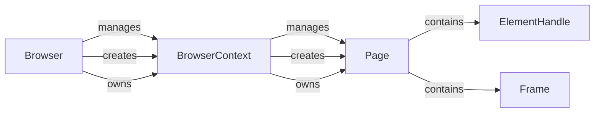

## Component Details

The Browser Automation component orchestrates interactions with web pages through Playwright. It initializes and manages the browser instance, creates isolated browsing contexts, and provides methods for navigating, executing JavaScript, and extracting DOM information. The core flow involves launching the browser, creating a context, navigating to a page, performing actions on the page, and extracting relevant data. This component serves as the foundation for automating web-based tasks and extracting information from websites.

### Browser
The `Browser` class manages the Playwright browser instance. It is responsible for launching and closing the browser, creating new browser contexts, and managing the overall browser lifecycle.
- **Related Classes/Methods**: `browser_use.browser.browser.Browser`

### BrowserContext
The `BrowserContext` class represents a single browsing context or session within the browser. It provides methods for navigating to pages, interacting with elements, executing JavaScript, and extracting data from the page. It manages tabs, cookies, and other context-specific settings, providing an isolated environment for each browsing session.
- **Related Classes/Methods**: `browser_use.browser.context.BrowserContext`

### Page
The `Page` class represents a single tab or page within a browser context. It provides methods for navigating to URLs, interacting with elements on the page, executing JavaScript code, and extracting content from the page. It is the primary interface for interacting with the content of a web page.
- **Related Classes/Methods**: `browser_use.browser.page.Page`

### ElementHandle
The `ElementHandle` class represents an in-page DOM element. ElementHandles can be created with the `page.$` method. ElementHandles allow performing actions on the element like clicking, filling, and hovering.
- **Related Classes/Methods**: `browser_use.browser.element_handle.ElementHandle`

### Frame
The `Frame` class represents an HTML frame within a page. It provides methods for interacting with the frame's content, including navigating to URLs, interacting with elements, and executing JavaScript code.
- **Related Classes/Methods**: `browser_use.browser.frame.Frame`
