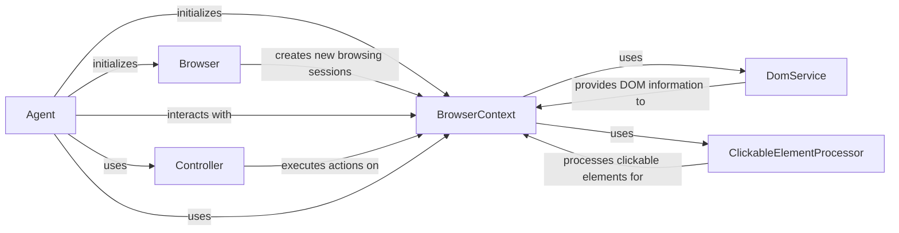

## Component Details

The Browser Control component orchestrates the interaction between the Agent and the browser. It receives actions from the Agent, translates them into browser commands, and executes them using the Browser Context. It manages the browser instance and its contexts, providing a controlled environment for the agent's actions. The core flow involves the Agent sending an action to the Controller, which then uses the BrowserContext to perform the action in the browser. The BrowserContext interacts with the DomService and ClickableElementProcessor to understand the browser's state. The Browser component manages the underlying browser instance.

### Browser
The Browser class manages the underlying browser instance (e.g., Chromium). It handles browser setup and context creation. It provides methods to create new browsing contexts and close the browser instance.
- **Related Classes/Methods**: `browser_use.browser.browser.Browser`, `browser_use/browser_use/browser/browser.py.BrowserConfig`

### BrowserContext
The BrowserContext class represents a browsing session within the browser. It manages tabs, navigation, page state, and element interaction. It uses playwright to interact with the browser and DomService to extract DOM information. It provides methods to navigate to URLs, get the page HTML, execute JavaScript, and get the current state of the browser.
- **Related Classes/Methods**: `browser_use.browser.context.BrowserContext`, `browser_use/browser_use/browser/context.py.BrowserContextConfig`, `browser_use/browser_use/browser/context.py.BrowserContextState`, `browser_use/browser_use/browser/context.py.BrowserSession`

### Agent
The Agent class is responsible for planning and executing actions in the browser. It uses the BrowserContext to get the current state of the browser and interact with web elements. It interacts with the Controller to execute actions and the BrowserContext to retrieve the browser state.
- **Related Classes/Methods**: `browser_use.agent.service.Agent`

### Controller
The Controller class receives actions from the Agent and translates them into browser interactions using the BrowserContext. It also handles drag and drop operations and cell selection. It interacts with the Agent to receive actions and the BrowserContext to execute them.
- **Related Classes/Methods**: `browser_use.controller.service.Controller`

### DomService
The DomService class is responsible for extracting and processing the DOM structure of a web page. It provides methods for identifying clickable elements and other relevant information. It interacts with BrowserContext to get the page content and Agent to provide clickable elements.
- **Related Classes/Methods**: `browser_use.dom.service.DomService`

### ClickableElementProcessor
The ClickableElementProcessor class is responsible for identifying and processing clickable elements within the DOM. It provides methods for extracting clickable elements and generating their hashes. It interacts with BrowserContext to get the page content.
- **Related Classes/Methods**: `browser_use.dom.clickable_element_processor.service.ClickableElementProcessor`
