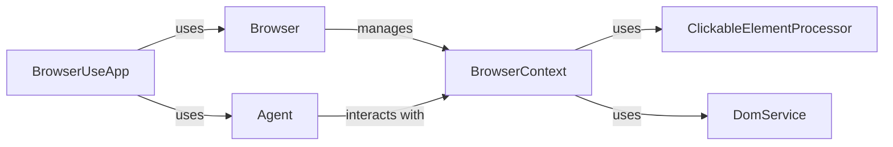

## Component Details

### Browser
The Browser class manages the Playwright browser instance. It is responsible for setting up the browser, creating browser contexts, and closing the browser when it's no longer needed. It acts as the entry point for interacting with the browser and provides a high-level interface for managing browser lifecycles.
- **Related Classes/Methods**: `browser_use.browser.browser.Browser`

### BrowserContext
The BrowserContext class provides an isolated browsing environment within the Browser. It manages tabs, navigation, and interaction with web pages. It uses BrowserSession to manage the Playwright page and browser context objects. It also utilizes ClickableElementProcessor and DomService for DOM manipulation and clickable element identification.
- **Related Classes/Methods**: `browser_use.browser.context.BrowserContext`, `/home/ivan/StartUp/CodeBoarding/repos/browser-use/browser_use/browser/context.py.BrowserContextConfig`, `/home/ivan/StartUp/CodeBoarding/repos/browser-use/browser_use/browser/context.py.BrowserContextState`, `/home/ivan/StartUp/CodeBoarding/repos/browser-use/browser_use/browser/context.py.BrowserSession`, `browser_use.dom.clickable_element_processor.service.ClickableElementProcessor`, `browser_use.dom.service.DomService`, `/home/ivan/StartUp/CodeBoarding/repos/browser-use/browser_use/browser/context.py.CachedStateClickableElementsHashes`, `browser_use.utils.time_execution_async`, `browser_use.utils.time_execution_sync`

### Agent
The Agent class orchestrates the interaction with the BrowserContext. It takes actions based on the current state of the browser and user input. It uses the BrowserContext to navigate web pages, extract content, and interact with elements. The Agent determines the next action to take based on the current state of the browser.
- **Related Classes/Methods**: `browser_use.agent.service.Agent`

### ClickableElementProcessor
The ClickableElementProcessor is responsible for processing the DOM to identify clickable elements. It analyzes the structure of the web page and identifies elements that can be clicked, such as buttons, links, and other interactive elements. This information is used by the Agent to interact with the web page.
- **Related Classes/Methods**: `browser_use.dom.clickable_element_processor.service.ClickableElementProcessor`

### DomService
The DomService provides DOM related utilities. It offers functionalities for interacting with and manipulating the Document Object Model (DOM) of a web page. This includes extracting content, modifying elements, and performing other DOM-related operations. It is used by BrowserContext and ClickableElementProcessor.
- **Related Classes/Methods**: `browser_use.dom.service.DomService`

### BrowserUseApp
The BrowserUseApp is a Textual application that manages the interaction between the Browser and the Agent. It provides a user interface for controlling the browser and agent, and it orchestrates the overall workflow of the application. It initializes and manages the Browser and Agent instances.
- **Related Classes/Methods**: `browser_use.cli.BrowserUseApp`
