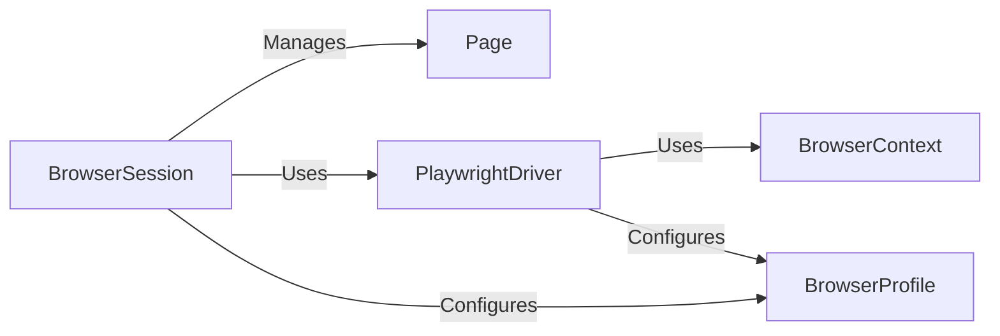

## Component Details

The Browser Management component orchestrates the browser instance lifecycle, configuration, and interaction with web pages. It initializes the browser with specified profiles, manages browser sessions, and provides an interface for navigating, interacting with elements, and retrieving page information. The component leverages Playwright for browser control and integrates with DOM processing functionalities for extracting and processing web page content.

### BrowserSession
The BrowserSession component manages a single browser session, encapsulating the browser's lifecycle, navigation, element interaction, and information retrieval. It serves as the central point for all browser interactions within a session, providing methods to start and stop the browser, navigate to URLs, interact with page elements, and retrieve page content and state.
- **Related Classes/Methods**: `browser_use.browser_use.browser.session.BrowserSession`

### BrowserProfile
The BrowserProfile component defines the configuration and launch arguments for the browser, enabling customization of browser settings such as user agent, viewport size, and proxy settings. It provides methods to configure the browser based on the desired launch type, allowing for different browser behaviors and environments.
- **Related Classes/Methods**: `browser_use.browser_use.browser.profile.BrowserProfile`

### PlaywrightDriver
The PlaywrightDriver component wraps the Playwright library, providing a low-level interface for interacting with the browser. It handles browser launching, context creation, page management, and other core Playwright functionalities. This component abstracts the complexities of Playwright and provides a simplified interface for other components to interact with the browser.
- **Related Classes/Methods**: `browser_use.browser_use.browser.driver.PlaywrightDriver`

### Page
The Page component represents a single tab or window within the browser. It provides methods for interacting with the content of the page, such as filling forms, clicking buttons, and extracting data. It is managed by the BrowserSession and provides the context for element interaction.
- **Related Classes/Methods**: _None_

### BrowserContext
The BrowserContext component provides an isolated browsing context with its own cookies, cache, and local storage. It allows for multiple independent browsing sessions within the same browser instance. It is managed by the PlaywrightDriver and used by BrowserSession.
- **Related Classes/Methods**: _None_