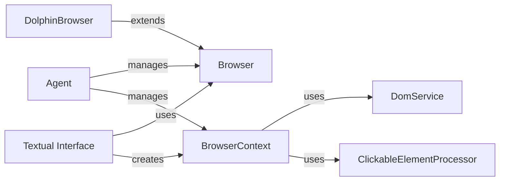

## Component Details

### Browser
The Browser class manages the underlying browser instance (e.g., Chrome, Firefox). It handles browser setup, including launching the browser with specific configurations (e.g., headless mode, user agent), managing browser contexts (sessions), and closing the browser instance.
- **Related Classes/Methods**: `browser_use.browser.browser.Browser`, `/home/ivan/StartUp/CodeBoarding/repos/browser-use/browser_use/browser/browser.py.BrowserConfig`

### BrowserContext
The BrowserContext class represents a browsing session or context within the browser. It manages tabs, navigation, page state, and interactions with web pages. It provides methods for navigating to URLs, executing JavaScript, extracting page content, locating elements, and simulating user actions like clicks and input.
- **Related Classes/Methods**: `browser_use.browser.context.BrowserContext`, `/home/ivan/StartUp/CodeBoarding/repos/browser-use/browser_use/browser/context.py.BrowserContextConfig`, `/home/ivan/StartUp/CodeBoarding/repos/browser-use/browser_use/browser/context.py.BrowserContextState`

### Agent
The Agent class acts as an interface between the user/application and the browser. It uses Browser and BrowserContext to perform actions in the browser, such as navigating to pages and extracting information. It manages the lifecycle of the browser and context.
- **Related Classes/Methods**: `browser_use.agent.service.Agent`

### DolphinBrowser
The DolphinBrowser class extends the Browser functionality to interact with Dolphin Anty browser profiles. It handles authentication, profile management (starting, stopping), and tab management within Dolphin Anty.
- **Related Classes/Methods**: `browser_use.browser.dolphin_service.DolphinBrowser`

### DomService
The DomService class is responsible for extracting and processing the Document Object Model (DOM) of a web page. It provides functionalities to get clickable elements.
- **Related Classes/Methods**: `browser_use.dom.service.DomService`

### ClickableElementProcessor
The ClickableElementProcessor class is responsible for identifying and processing clickable elements within a web page's DOM. It provides functionalities to get clickable elements and their hashes.
- **Related Classes/Methods**: `browser_use.dom.clickable_element_processor.service.ClickableElementProcessor`

### Textual Interface
The textual interface is the command line interface of the application. It allows the user to interact with the browser through text commands.
- **Related Classes/Methods**: `browser_use.cli:textual_interface`
