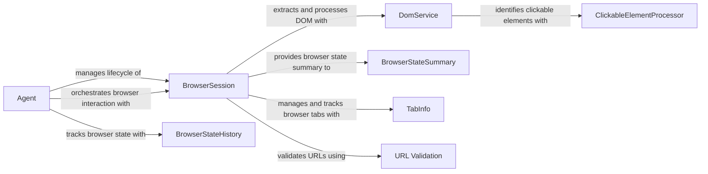

## Component Details

The Browser Management component orchestrates web browser interactions using Playwright. It encompasses the lifecycle management of browser instances, DOM extraction and processing, and intelligent agent-driven navigation. The core flow involves initializing a browser session, navigating to URLs, extracting the DOM, identifying clickable elements, and allowing an agent to interact with the page based on a defined strategy. This system facilitates automated web browsing, data extraction, and interaction for various applications.

### BrowserSession
The BrowserSession class manages the lifecycle of a browser instance, including setup, navigation, interaction, and cleanup. It provides methods for opening tabs, navigating to URLs, executing JavaScript, extracting DOM content, and interacting with page elements. It uses Playwright to interact with the browser and relies on other components like DomService and ClickableElementProcessor for specific tasks.
- **Related Classes/Methods**: `browser_use.browser.session.BrowserSession`

### DomService
The DomService class provides functionality for extracting and processing the DOM of a web page. It is used to identify clickable elements and extract relevant information from the DOM structure. It interacts with BrowserSession to retrieve the DOM and ClickableElementProcessor to identify clickable elements.
- **Related Classes/Methods**: `browser_use.dom.service.DomService`

### ClickableElementProcessor
The ClickableElementProcessor class is responsible for identifying and processing clickable elements within the DOM. It extracts relevant attributes and generates hashes for these elements. It is used by DomService to identify clickable elements in the DOM.
- **Related Classes/Methods**: `browser_use.dom.clickable_element_processor.service.ClickableElementProcessor`

### Agent
The Agent class orchestrates the browser interaction based on a defined strategy. It uses the BrowserSession to navigate, extract information, and interact with web pages to achieve a specific goal. It relies on BrowserStateHistory to track the browser's state and make informed decisions.
- **Related Classes/Methods**: `browser_use.agent.service.Agent`

### BrowserStateSummary
The BrowserStateSummary class encapsulates the state of the browser at a given point in time, including the current URL, DOM structure, and identified clickable elements. It provides a snapshot of the browser's state for analysis and decision-making. It is used by BrowserSession to provide a summary of the current browser state.
- **Related Classes/Methods**: `browser_use.browser.views.BrowserStateSummary`

### BrowserStateHistory
The BrowserStateHistory class maintains a history of browser states, allowing the agent to track its navigation and interaction with web pages over time. It is used by the Agent to track its progress and make informed decisions.
- **Related Classes/Methods**: `browser_use.browser.views.BrowserStateHistory`

### TabInfo
The TabInfo class represents information about a single browser tab, such as its title and URL. It is used by BrowserSession to manage and track browser tabs.
- **Related Classes/Methods**: `browser_use.browser.views.TabInfo`

### URL Validation
The URL validation component includes the `URLNotAllowedError` exception and the `match_url_with_domain_pattern` function. It ensures that the browser only navigates to allowed URLs based on a configured allowlist.
- **Related Classes/Methods**: `browser_use.browser.views.URLNotAllowedError`, `browser_use.utils.match_url_with_domain_pattern`