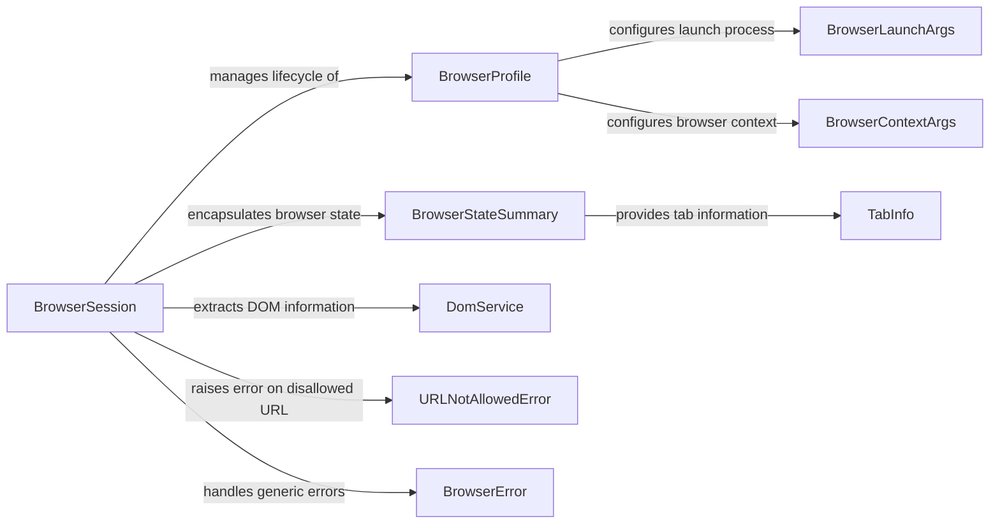

## Component Details

The Browser Management component orchestrates browser interactions, providing a high-level interface for controlling and extracting information from web pages. It manages the browser lifecycle, configuration, navigation, and DOM extraction, abstracting away the complexities of browser automation. The central class, BrowserSession, utilizes BrowserProfile for configuration and DomService for content extraction, while BrowserStateSummary provides a snapshot of the browser's current state.

### BrowserSession
The BrowserSession class manages the lifecycle of a browser instance, including setup, navigation, tab management, and state retrieval. It acts as the central point for interacting with the browser, utilizing Playwright for browser control and DomService for extracting DOM information. It also handles errors and caches element hashes for performance.
- **Related Classes/Methods**: `browser-use.browser_use.browser.session.BrowserSession`

### BrowserProfile
The BrowserProfile class encapsulates the configuration settings for the browser, such as user agent, viewport size, and proxy settings. It is used to create a consistent and reproducible browser environment. It relies on BrowserLaunchArgs and BrowserContextArgs to define the browser's launch and context parameters.
- **Related Classes/Methods**: `browser-use.browser_use.browser.profile.BrowserProfile`

### BrowserLaunchArgs
The BrowserLaunchArgs class defines the arguments used to launch the browser, such as the executable path and headless mode. It provides a way to customize the browser launch process.
- **Related Classes/Methods**: `browser-use.browser_use.browser.profile.BrowserLaunchArgs`

### BrowserContextArgs
The BrowserContextArgs class defines the arguments used to create a new browser context, such as viewport size and user agent. It allows customization of the browser context.
- **Related Classes/Methods**: `browser-use.browser_use.browser.profile.BrowserContextArgs`

### BrowserStateSummary
The BrowserStateSummary class encapsulates the overall state of the browser, including tab information, clickable elements, and other relevant data. It provides a snapshot of the browser's current state, including a list of TabInfo objects.
- **Related Classes/Methods**: `browser-use.browser_use.browser.views.BrowserStateSummary`

### TabInfo
The TabInfo class represents information about a browser tab, such as its title and URL. It is used to provide a summary of the current browser state.
- **Related Classes/Methods**: `browser-use.browser_use.browser.views.TabInfo`

### DomService
The DomService class extracts and processes the DOM structure of a web page. It provides methods for identifying clickable elements and other relevant information. It is used by BrowserSession to extract DOM information.
- **Related Classes/Methods**: `browser-use.browser_use.dom.service.DomService`

### URLNotAllowedError
The URLNotAllowedError class represents an error that occurs when the browser attempts to navigate to a URL that is not allowed based on configured domain patterns. It is raised by BrowserSession when navigation to a disallowed URL is attempted.
- **Related Classes/Methods**: `browser-use.browser_use.browser.views.URLNotAllowedError`

### BrowserError
The BrowserError class represents a generic error that occurs during browser interaction, such as navigation failures or element interaction issues. It is a base class for other browser-related errors.
- **Related Classes/Methods**: `browser-use.browser_use.browser.views.BrowserError`