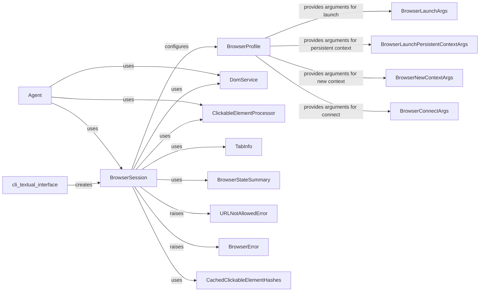

## Component Details

The browser automation subsystem enables automated interaction with web pages through a browser. It centers around the `BrowserSession`, which manages the browser instance and provides methods for navigation, interaction, and content extraction. The `BrowserProfile` configures the browser's behavior. The `Agent` orchestrates complex tasks using the `BrowserSession`, while the `DomService` and `ClickableElementProcessor` facilitate DOM interaction and clickable element identification, respectively. The `TabInfo` and `BrowserStateSummary` provide information about the browser's state. Error handling is managed through `URLNotAllowedError` and `BrowserError`. Performance is optimized using `CachedClickableElementHashes`.

### BrowserSession
Manages a single browser session using Playwright. It handles browser startup, shutdown, tab management, navigation, and interaction with web elements. It provides methods for getting page content, executing JavaScript, and taking screenshots.
- **Related Classes/Methods**: `browser_use.browser.session.BrowserSession`, `browser_use.browser.session.CachedClickableElementHashes`

### BrowserProfile
Manages browser launch arguments and settings. It allows users to configure the browser's behavior, such as setting the user agent and viewport size. It provides methods for generating the arguments needed to launch a browser instance with the desired configuration.
- **Related Classes/Methods**: `browser_use.browser.profile.BrowserProfile`, `browser_use.browser.profile.BrowserLaunchArgs`, `browser_use.browser.profile.BrowserLaunchPersistentContextArgs`, `browser_use.browser.profile.BrowserNewContextArgs`, `browser_use.browser.profile.BrowserConnectArgs`

### Agent
Orchestrates browser automation tasks using the BrowserSession. It provides a higher-level API for performing complex tasks, such as filling out forms and extracting data from web pages.
- **Related Classes/Methods**: `browser_use.agent.service.Agent`

### DomService
Provides methods for interacting with the Document Object Model (DOM) of a web page. It allows users to extract information about web elements, such as their text content and attributes.
- **Related Classes/Methods**: `browser_use.dom.service.DomService`

### ClickableElementProcessor
Identifies clickable elements on a web page using heuristics. It determines which elements are likely to be interactive and provides methods for clicking on those elements.
- **Related Classes/Methods**: `browser_use.dom.clickable_element_processor.service.ClickableElementProcessor`

### TabInfo
Represents information about a browser tab, such as its title and URL. It is used to provide a summary of the current state of the browser.
- **Related Classes/Methods**: `browser_use.browser.views.TabInfo`

### BrowserStateSummary
Represents a summary of the current state of the browser, including information about the current tab, the DOM, and the clickable elements on the page.
- **Related Classes/Methods**: `browser_use.browser.views.BrowserStateSummary`

### URLNotAllowedError
Exception raised when the browser attempts to navigate to a URL that is not allowed by the current configuration.
- **Related Classes/Methods**: `browser_use.browser.views.URLNotAllowedError`

### BrowserError
Base class for all browser-related errors.
- **Related Classes/Methods**: `browser_use.browser.views.BrowserError`

### CachedClickableElementHashes
Caches the hashes of clickable elements on a web page to improve performance by avoiding redundant calculations.
- **Related Classes/Methods**: `browser_use.browser.session.CachedClickableElementHashes`