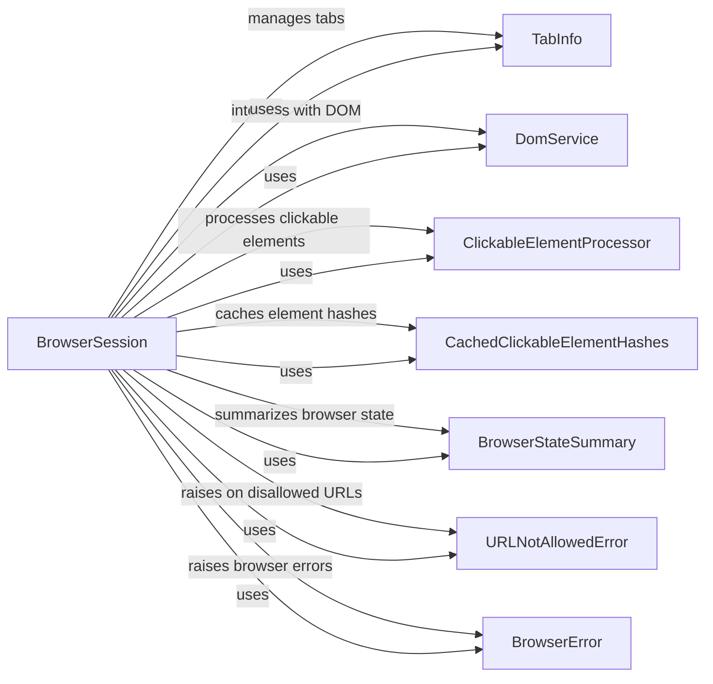

## Component Details

The Browser Session component orchestrates the interaction with a web browser using Playwright. It manages the browser lifecycle, including launching and closing, and provides methods for creating new tabs, navigating to URLs, and interacting with web page elements. It retrieves the browser state, including tab information, screenshots, and clickable elements, and handles URL allowlisting to prevent navigation to unauthorized domains. The component leverages caching to optimize performance and provides logging for debugging purposes.

### BrowserSession
Manages the Playwright browser instance, including launching, closing, and creating new pages (tabs). It provides methods for navigating to URLs, interacting with DOM elements, and retrieving the browser state.
- **Related Classes/Methods**: `browser_use.browser.session.BrowserSession`

### TabInfo
A data class that holds information about a browser tab, such as its title and URL. It's used by BrowserSession to provide a summary of the open tabs.
- **Related Classes/Methods**: `browser_use.browser.views.TabInfo`

### DomService
Provides functionality for interacting with the Document Object Model (DOM) of a web page. It's used by BrowserSession to extract information about the page structure and clickable elements.
- **Related Classes/Methods**: `browser_use.dom.service.DomService`

### ClickableElementProcessor
Responsible for identifying and processing clickable elements on a web page. It's used by BrowserSession to determine the interactive elements in the current browser state.
- **Related Classes/Methods**: `browser_use.dom.clickable_element_processor.service.ClickableElementProcessor`

### CachedClickableElementHashes
Provides a caching mechanism for clickable element hashes to improve performance when retrieving the browser state.
- **Related Classes/Methods**: `browser_use.browser.session.CachedClickableElementHashes`

### BrowserStateSummary
A data class that encapsulates the overall state of the browser, including tab information, screenshots, and clickable elements. It's returned by BrowserSession when retrieving the browser state.
- **Related Classes/Methods**: `browser_use.browser.views.BrowserStateSummary`

### URLNotAllowedError
An exception that is raised when navigation to a URL is blocked by the configured URL allowlist.
- **Related Classes/Methods**: `browser_use.browser.views.URLNotAllowedError`

### BrowserError
A base exception class for browser-related errors.
- **Related Classes/Methods**: `browser_use.browser.views.BrowserError`