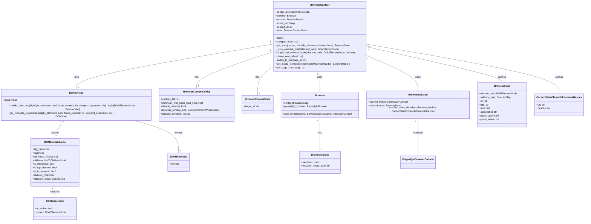

Okay, I have examined the source code of the core components. Here's a refined overview of the `BrowserContext` component:

**Component Description:**

The `BrowserContext` component is responsible for managing a single browser session. It encapsulates the Playwright `BrowserContext` and provides a higher-level API for interacting with web pages. It handles browser initialization, tab management, navigation, DOM interaction, and state management. The `BrowserContext` also manages cookies, handles URL allowlisting, and provides methods for taking screenshots and extracting the page structure. It uses `DomService` to build a DOM tree representation of the page.

**Main Classes and Their Purposes:**

*   **`BrowserContext`**: The main class that manages the browser session.
    *   `_initialize_session()`: Initializes the Playwright browser context, sets up event listeners, and loads cookies.
    *   `close()`: Closes the browser context and releases resources.
    *   `navigate_to()`: Navigates the current tab to a specified URL.
    *   `get_state()`: Retrieves the current state of the browser, including the DOM tree, URL, title, and screenshot.
    *   `_click_element_node()`: Simulates a click on a DOM element.
    *   `_input_text_element_node()`: Simulates typing text into a DOM element.
    *   `create_new_tab()`: Creates a new tab in the browser.
    *   `switch_to_tab()`: Switches to a specific tab.
*   **`BrowserSession`**: Encapsulates the Playwright `BrowserContext` and manages the active tab and cached state.
*   **`BrowserContextConfig`**: Configuration class for the `BrowserContext`, defining settings such as headless mode, security, cookies file, and timeouts.
*   **`BrowserContextState`**: Represents the state of the browser context, including the CDP target ID.
*   **`DomService`**: Provides services for interacting with the DOM, such as building the DOM tree and extracting clickable elements.
*   **`DOMElementNode`**: Represents a DOM element in the tree structure.
*   **`DOMTextNode`**: Represents a text node in the DOM tree.
*   **`Browser`**: Represents the Playwright Browser and is responsible for launching and managing the browser process.

**Visualization:**

I will use a class diagram to represent the structure of the `BrowserContext` component.

