```mermaid
graph LR
    BrowserProfile["BrowserProfile"]
    BrowserSession["BrowserSession"]
    DOMState["DOMState"]
    BrowserStateSummary["BrowserStateSummary"]
    ChatModel["ChatModel"]
    FileSystem["FileSystem"]
    CloudSync["CloudSync"]
    DeviceAuthClient["DeviceAuthClient"]
    TelemetryService["TelemetryService"]
    DeviceAuthClient -- "Launches" --> BrowserSession
    BrowserSession -- "Interacts with" --> DOMState
    DOMState -- "Provides state to" --> BrowserStateSummary
    BrowserStateSummary -- "Summarizes" --> BrowserProfile
    ChatModel -- "Uses" --> FileSystem
    FileSystem -- "Managed by" --> CloudSync
    CloudSync -- "Synchronizes with" --> DeviceAuthClient
    DeviceAuthClient -- "Authenticates" --> TelemetryService
```

## Details

One paragraph explaining the functionality which is represented by this graph. What the main flow is and what is its purpose.

### BrowserProfile
Manages browser profiles

**Related Classes/Methods**:

- <a href="https://github.com/browser-use/browser-use/blob/main/browser_use/browser/profile.py#L528-L929" target="_blank" rel="noopener noreferrer">`browser_use.browser.profile.BrowserProfile` (528:929)</a>

### BrowserSession
Handles browser sessions

**Related Classes/Methods**:

- <a href="https://github.com/browser-use/browser-use/blob/main/browser_use/browser/session.py#L205-L4684" target="_blank" rel="noopener noreferrer">`browser_use.browser.session.BrowserSession` (205:4684)</a>

### DOMState
Represents the state of the DOM

**Related Classes/Methods**:

- `browser_use.dom.state.DOMState`

### BrowserStateSummary
Provides a summary of the browser state

**Related Classes/Methods**:

- `browser_use.browser.state_summary.BrowserStateSummary`

### ChatModel
Base class for chat models

**Related Classes/Methods**:

- `browser_use.llm.chat_model.ChatModel`

### FileSystem
Manages file systems

**Related Classes/Methods**:

- `browser_use.filesystem.files.FileSystem`

### CloudSync
Responsible for cloud synchronization

**Related Classes/Methods**:

- `browser_use.sync.cloud_sync.CloudSync`

### DeviceAuthClient
Handles device authentication

**Related Classes/Methods**:

- `browser_use.config.device_auth_client.DeviceAuthClient`

### TelemetryService
Handles telemetry services

**Related Classes/Methods**:

- <a href="https://github.com/browser-use/browser-use/blob/main/browser_use/telemetry/service.py#L23-L113" target="_blank" rel="noopener noreferrer">`browser_use.telemetry.service.ProductTelemetry` (23:113)</a>

### [FAQ](https://github.com/CodeBoarding/GeneratedOnBoardings/tree/main?tab=readme-ov-file#faq)